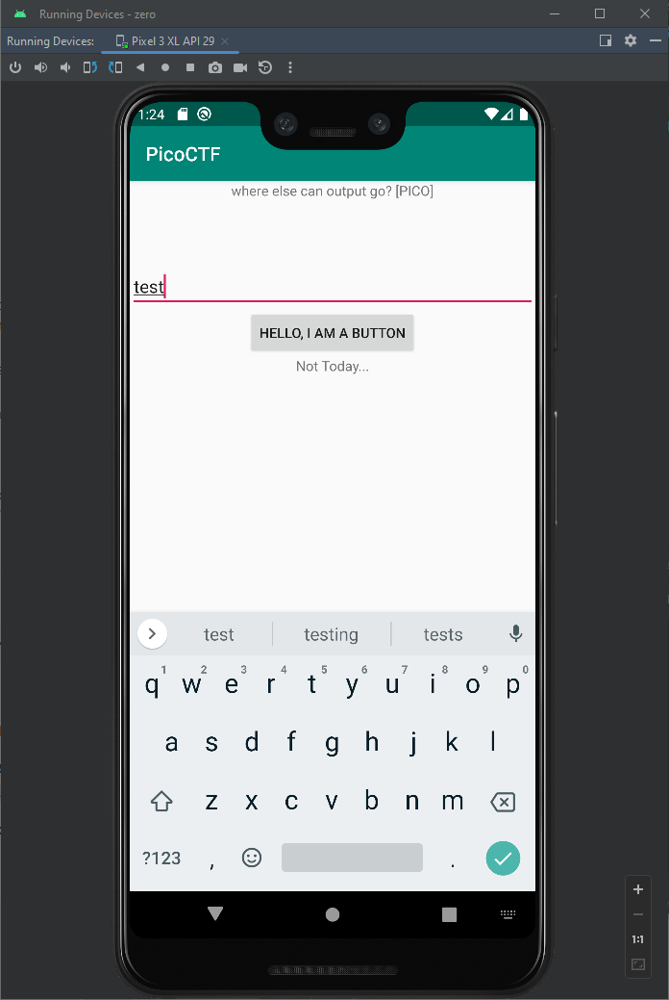

# droids0

- [Challenge information](#challenge-information)
- [Solutions](#solutions)
- [References](#references)

## Challenge information
```
Points: 300
Tags: picoCTF 2019, Reverse Engineering
Author: JASON

Description:
Where do droid logs go. Check out this file.

Hints:
1. Try using an emulator or device
2. https://developer.android.com/studio
```

## Solutions

First lets check the SDK-version from the `AndroidManifest.xml` file
```bash
┌──(kali㉿kali)-[/mnt/…/picoCTF/picoCTF_2019/Reverse_Engineering/Droids0]
└─$ apktool decode -o zero zero.apk 
Picked up _JAVA_OPTIONS: -Dawt.useSystemAAFontSettings=on -Dswing.aatext=true
I: Using Apktool 2.7.0-dirty on zero.apk
I: Loading resource table...
I: Decoding AndroidManifest.xml with resources...
I: Loading resource table from file: /home/kali/.local/share/apktool/framework/1.apk
I: Regular manifest package...
I: Decoding file-resources...
I: Decoding values */* XMLs...
I: Baksmaling classes.dex...
I: Copying assets and libs...
I: Copying unknown files...
I: Copying original files...

┌──(kali㉿kali)-[/mnt/…/picoCTF/picoCTF_2019/Reverse_Engineering/Droids0]
└─$ cat zero/AndroidManifest.xml 
<?xml version="1.0" encoding="utf-8" standalone="no"?><manifest xmlns:android="http://schemas.android.com/apk/res/android" android:compileSdkVersion="29" android:compileSdkVersionCodename="10" package="com.hellocmu.picoctf" platformBuildVersionCode="29" platformBuildVersionName="10">
    <application android:allowBackup="true" android:appComponentFactory="androidx.core.app.CoreComponentFactory" android:debuggable="true" android:icon="@mipmap/ic_launcher" android:label="@string/app_name" android:roundIcon="@mipmap/ic_launcher_round" android:supportsRtl="true" android:theme="@style/AppTheme">
        <activity android:name="com.hellocmu.picoctf.MainActivity">
            <intent-filter>
                <action android:name="android.intent.action.MAIN"/>
                <category android:name="android.intent.category.LAUNCHER"/>
            </intent-filter>
        </activity>
    </application>
</manifest>  
```

We can see from the manifest file that the application uses SDK-version 29.

Then open the `zero.apk` file in [Android Studio](https://developer.android.com/studio). I selected the `Profile or Debug APK` option. 

Now, we run/emulate the application on a virtual device with SDK-version 29. My virtual device was a `Pixel_3_XL_API_29` device. Select `Run 'zero'` from the `Run`-menu in Android Studio.

I had a lot of trouble getting Android Studio to understand I wanted to use SDK-version 29. I got a `Error: Please select Android SDK` and also a notifaction saying 
```
SDK not found
Failed to find Android target '29'
Install missing platform and fix project
```

The last notification line was a clickable link and when clicked the SDK was downloaded and I was able to run the application.  
Input anything in the text field (such as `test`) and click the `HELLO, I AM A BUTTON`-button.



Then go back to Android Studio and click the `logcat` tab. Each time you press the button a message will be printed here with the flag included  
`PICO   com.hellocmu.picoctf   I  picoCTF{<REDACTED>}`

For additional information, please see the references below.

## References

- [Android Studio](https://developer.android.com/studio)
- [Wikipedia - apk (file format)](https://en.wikipedia.org/wiki/Apk_(file_format))
