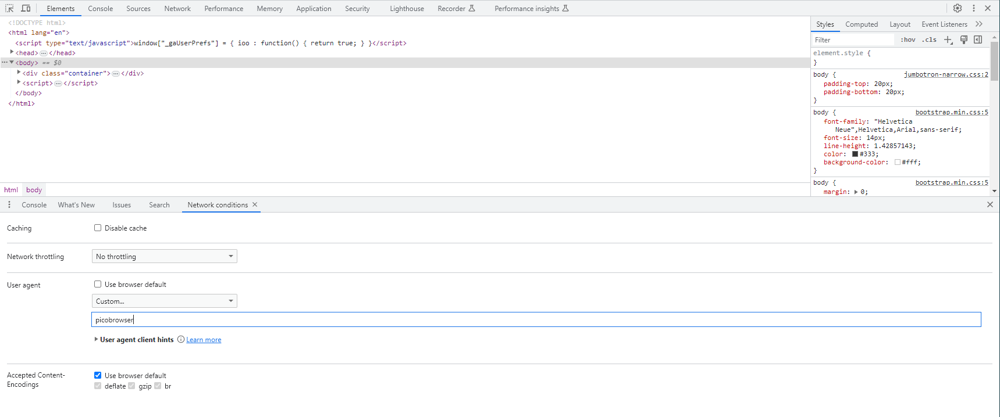

# picobrowser

- [Challenge information](#challenge-information)
- [Solution](#solution)
- [References](#references)

## Challenge information
```
Points: 200
Tags: picoCTF 2019, Web Exploitation
Author: ARCHIT
 
Description:
This website can be rendered only by picobrowser, go and catch the flag! 

https://jupiter.challenges.picoctf.org/problem/26704/ or http://jupiter.challenges.picoctf.org:26704

Hints:
1. You don't need to download a new web browser
```
Challenge link: [https://play.picoctf.org/practice/challenge/9](https://play.picoctf.org/practice/challenge/9)

## Solution

Browsing to the website you see a big `Flag` button that sends you to `/flag` and displays the message `You're not picobrowser!`.  
We have the wrong [user-agent header](https://en.wikipedia.org/wiki/User-Agent_header).

### Curl solution

The user-agent is easiest changed with `curl`. Then we can just `grep` for the flag
```bash
┌──(kali㉿kali)-[/mnt/…/picoCTF/picoCTF_2019/Web_Exploitation/Picobrowser]
└─$ curl -s -A picobrowser http://jupiter.challenges.picoctf.org:26704/flag | grep -oE 'picoCTF{.*}'
picoCTF{<REDACTED>}
```

### DevTools solution

An alternative solution is to use your browsers DevTools. 

Press F12 to open DevTools and then click on the three dots-button in the upper right corner of DevTools.  
Select `More Tools` in the popup-menu and then select `Network conditions`.  
A new section with the `Network conditions` tab selected opens up in the lower part of DevTools.  
In the `User agent` part, deselect the `Use browser default` checkbox. Enter `picobrowser` in the textbox.



Reload the web page by pressing `F5` and the flag is shown.

For additional information, please see the references below.

## References

- [curl - Linux manual page](https://man7.org/linux/man-pages/man1/curl.1.html)
- [grep - Linux manual page](https://man7.org/linux/man-pages/man1/grep.1.html)
- [Wikipedia - User-Agent header](https://en.wikipedia.org/wiki/User-Agent_header)
