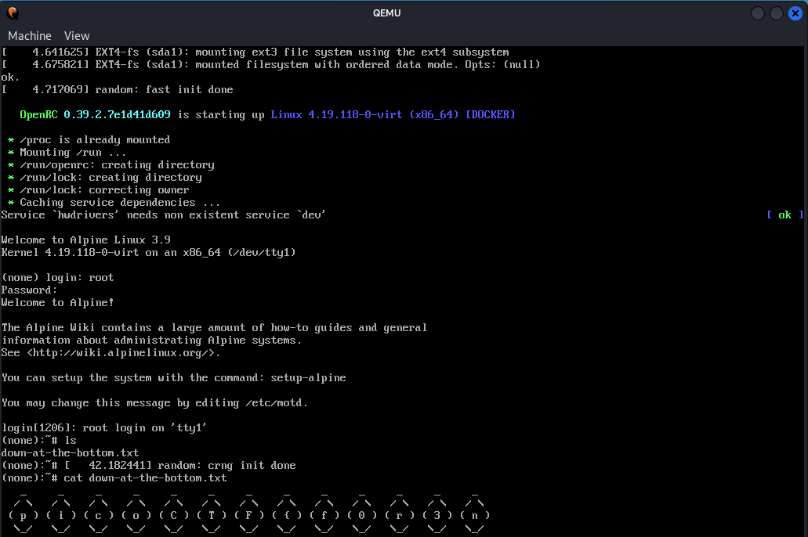

# Disk, disk, sleuth! II

- [Challenge information](#challenge-information)
- [Sleuthkit Solution](#sleuthkit-solution)
- [Boot in Qemu solution](#boot-in-qemu-solution)
- [References](#references)

## Challenge information
```
Points: 130
Tags: picoCTF 2021, Forensics
Author: SYREAL
 
Description:
All we know is the file with the flag is named `down-at-the-bottom.txt`... 
Disk image: dds2-alpine.flag.img.gz

Hints:
1. The sleuthkit has some great tools for this challenge as well.
2. Sleuthkit docs here are so helpful: TSK Tool Overview
3. This disk can also be booted with qemu!
```
Challenge link: [https://play.picoctf.org/practice/challenge/137](https://play.picoctf.org/practice/challenge/137)

## Sleuthkit solution

### Unpack the image file

Let's start with unpacking and analysing the given file
```bash
┌──(kali㉿kali)-[/mnt/…/picoCTF/picoCTF_2021/Forensics/Disk_disk_sleuth_II]
└─$ gunzip dds2-alpine.flag.img.gz   
gzip: dds2-alpine.flag.img: Value too large for defined data type

┌──(kali㉿kali)-[/mnt/…/picoCTF/picoCTF_2021/Forensics/Disk_disk_sleuth_II]
└─$ file dds2-alpine.flag.img   
dds2-alpine.flag.img: DOS/MBR boot sector; partition 1 : ID=0x83, active, start-CHS (0x0,32,33), end-CHS (0x10,81,1), startsector 2048, 260096 sectors
```

So we have a disk image with a MBR boot sector and one partition.

### Get an overview of the disk and the file system

Next we display the layout of the disk with `mmls`
```bash
┌──(kali㉿kali)-[/mnt/…/picoCTF/picoCTF_2021/Forensics/Disk_disk_sleuth_II]
└─$ mmls dds2-alpine.flag.img                
DOS Partition Table
Offset Sector: 0
Units are in 512-byte sectors

      Slot      Start        End          Length       Description
000:  Meta      0000000000   0000000000   0000000001   Primary Table (#0)
001:  -------   0000000000   0000002047   0000002048   Unallocated
002:  000:000   0000002048   0000262143   0000260096   Linux (0x83)
```

The offset to the Linux file system is 2048.

We can get file system details with `fsstat`
```bash
┌──(kali㉿kali)-[/mnt/…/picoCTF/picoCTF_2021/Forensics/Disk_disk_sleuth_II]
└─$ fsstat -o 2048 dds2-alpine.flag.img 
FILE SYSTEM INFORMATION
--------------------------------------------
File System Type: Ext3
Volume Name: 
Volume ID: dc53a3bb0ae739a5164c89db56bbb12f

Last Written at: 2021-02-16 13:21:20 (EST)
Last Checked at: 2021-02-16 13:21:19 (EST)

Last Mounted at: 2021-02-16 13:21:19 (EST)
Unmounted properly
Last mounted on: /os/mnt

Source OS: Linux
Dynamic Structure
Compat Features: Journal, Ext Attributes, Resize Inode, Dir Index
InCompat Features: Filetype, 
Read Only Compat Features: Sparse Super, Large File, 
<---snip--->
```

### Search for the file

Let's search for the file named `down-at-the-bottom.txt` with `fls` and `grep`
```bash
┌──(kali㉿kali)-[/mnt/…/picoCTF/picoCTF_2021/Forensics/Disk_disk_sleuth_II]
└─$ fls -F -r -o 2048 dds2-alpine.flag.img | grep down-at-the-bottom.txt
r/r 18291:      root/down-at-the-bottom.txt
```

The file is stored in [inode](https://en.wikipedia.org/wiki/Inode) `18291`.

### Get the flag

Now we can get the content of the file with `icat`
```bash
┌──(kali㉿kali)-[/mnt/…/picoCTF/picoCTF_2021/Forensics/Disk_disk_sleuth_II]
└─$ icat -o 2048 dds2-alpine.flag.img 18291                        
   _     _     _     _     _     _     _     _     _     _     _     _     _  
  / \   / \   / \   / \   / \   / \   / \   / \   / \   / \   / \   / \   / \ 
 ( p ) ( i ) ( c ) ( o ) ( C ) ( T ) ( F ) ( { ) ( X ) ( X ) ( X ) ( X ) ( X )
  \_/   \_/   \_/   \_/   \_/   \_/   \_/   \_/   \_/   \_/   \_/   \_/   \_/ 
   _     _     _     _     _     _     _     _     _     _     _     _     _  
  / \   / \   / \   / \   / \   / \   / \   / \   / \   / \   / \   / \   / \ 
 ( X ) ( X ) ( X ) ( X ) ( X ) ( X ) ( X ) ( _ ) ( X ) ( X ) ( X ) ( X ) ( X )
  \_/   \_/   \_/   \_/   \_/   \_/   \_/   \_/   \_/   \_/   \_/   \_/   \_/ 
   _     _     _     _     _     _     _     _     _     _     _  
  / \   / \   / \   / \   / \   / \   / \   / \   / \   / \   / \ 
 ( X ) ( _ ) ( X ) ( X ) ( X ) ( X ) ( X ) ( X ) ( X ) ( X ) ( } )
  \_/   \_/   \_/   \_/   \_/   \_/   \_/   \_/   \_/   \_/   \_/ 
```

Note that I have redacted some letters with the letter `X` here.

Let's use some command-line kung-fu to get the flag in a more easily readable form with `grep` and `tr`
```bash
┌──(kali㉿kali)-[/mnt/…/picoCTF/picoCTF_2021/Forensics/Disk_disk_sleuth_II]
└─$ icat -o 2048 dds2-alpine.flag.img 18291 | grep '(' | tr -d '() \n'
picoCTF{<REDACTED>}
```

## Boot in Qemu solution

Alternatively we can boot the disk in [QEMU](https://www.qemu.org/) as suggested in one of the hints.  
Install with `sudo apt install qemu-system-x86` if needed.

Then we boot with
```bash
┌──(kali㉿kali)-[/mnt/…/picoCTF/picoCTF_2021/Forensics/Disk_disk_sleuth_II]
└─$ qemu-system-x86_64 -drive format=raw,file=dds2-alpine.flag.img
```

A new window appears and the disk starts booting. After a few seconds you are prompted to login.  
Login with username `root` and password `root`.

The home directory is `/root` were the file is located. So you can just `cat` the file to get the flag.  
When you are done use `poweroff` to shutdown the virtual machine.



For additional information, please see the references below.

## References

- [grep - Linux manual page](https://man7.org/linux/man-pages/man1/grep.1.html)
- [tr - Linux manual page](https://man7.org/linux/man-pages/man1/tr.1.html)
- [The Sleuthkit - Tool Overview](http://wiki.sleuthkit.org/index.php?title=TSK_Tool_Overview)
- [QEMU - Home page](https://www.qemu.org/)
- [Wikipedia - inode](https://en.wikipedia.org/wiki/Inode)
