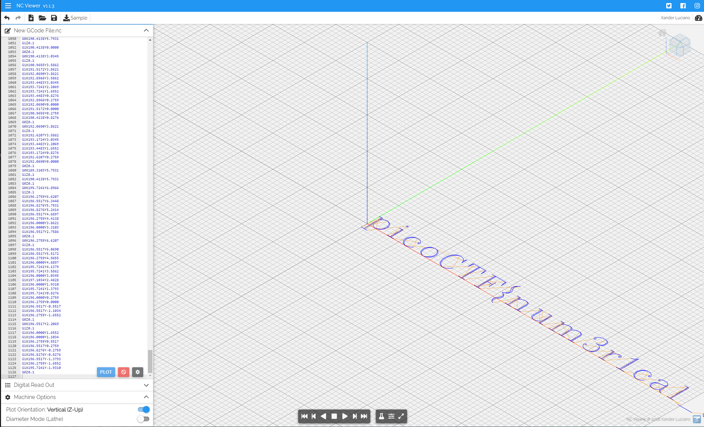

# speeds and feeds

- [Challenge information](#challenge-information)
- [Solutions](#solutions)
- [References](#references)

## Challenge information
```
Points: 50
Tags: picoCTF 2021, Reverse Engineering
Author: RYAN RAMSEYER

Description:
There is something on my shop network running at nc mercury.picoctf.net 59953, but I can't tell what it is. 
Can you?

Hints:
1. What language does a CNC machine use?
```

## Solutions

### Analyze the output

Lets start by connecting to the service and watch the output
```bash
┌──(kali㉿kali)-[/mnt/…/picoCTF/picoCTF_2021/Reverse_Engineering/speeds_and_feeds]
└─$ nc mercury.picoctf.net 59953
G17 G21 G40 G90 G64 P0.003 F50
G0Z0.1
G0Z0.1
G0X0.8276Y3.8621
G1Z0.1
G1X0.8276Y-1.9310
G0Z0.1
G0X1.1034Y3.8621
G1Z0.1
G1X1.1034Y-1.9310
G0Z0.1
G0X1.1034Y3.0345
G1Z0.1
G1X1.6552Y3.5862
G1X2.2069Y3.8621
G1X2.7586Y3.8621
G1X3.5862Y3.5862
G1X4.1379Y3.0345
G1X4.4138Y2.2069
G1X4.4138Y1.6552
G1X4.1379Y0.8276
G1X3.5862Y0.2759
G1X2.7586Y0.0000
<---snip--->
```

A LOT of output in some unknown format. Lets save it in a local file
```bash
┌──(kali㉿kali)-[/mnt/…/picoCTF/picoCTF_2021/Reverse_Engineering/speeds_and_feeds]
└─$ nc mercury.picoctf.net 59953 > speeds_and_feeds_output.txt
```

Now it's time to research what kind of format this is...  
It looks like it is something called [G-code](https://en.wikipedia.org/wiki/G-code).

Next, we need to find an online interpreter for it. [NC Viewer](https://ncviewer.com/) is one.

### Get the flag

In `NC Viewer`, click on the New File icon and paste in the output from the `speeds_and_feeds_output.txt` file above.  
Then click the `PLOT` button.

The result should look something like this:



Zoom out and re-position the grid and you have the whole flag.

For additional information, please see the references below.

## References

- [Wikipedia - G-code](https://en.wikipedia.org/wiki/G-code)
