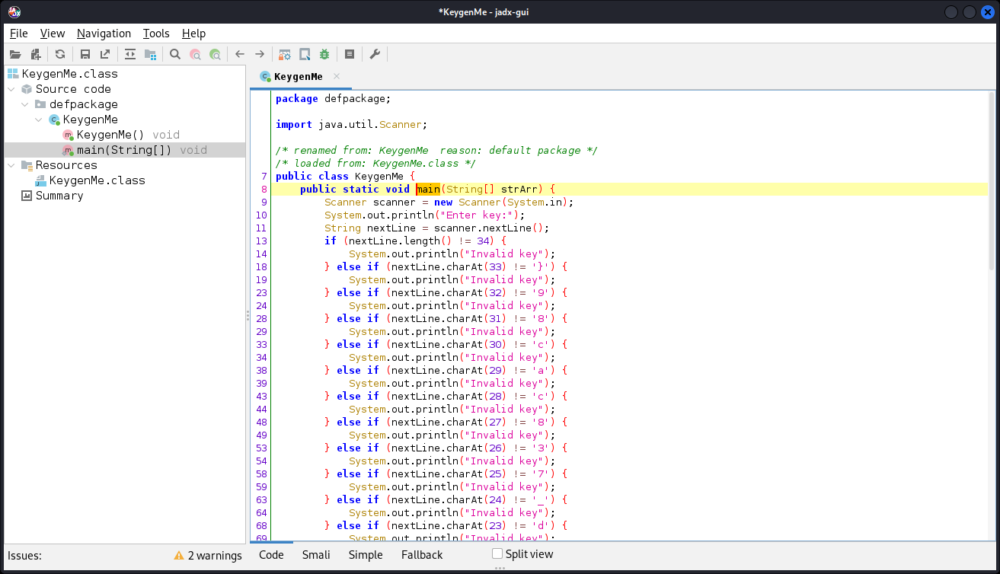

# Fresh Java

- [Challenge information](#challenge-information)
- [Solution](#solution)
- [References](#references)

## Challenge information
```
Points: 200
Tags: picoCTF 2022, Reverse Engineering, Java
Author: LT 'SYREAL' JONES

Description:
Can you get the flag?
Reverse engineer this Java program.

Hints:
1. Use a decompiler for Java!
```
Challenge link: [https://play.picoctf.org/practice/challenge/271](https://play.picoctf.org/practice/challenge/271)

## Solution

### Analyse the given file

The given file is a compiled [Java](https://en.wikipedia.org/wiki/Java_(programming_language)) file
```bash
┌──(kali㉿kali)-[/mnt/…/picoCTF/picoCTF_2022/Reverse_Engineering/Fresh_Java]
└─$ file KeygenMe.class
KeygenMe.class: compiled Java class data, version 55.0 (Java SE 11)
```

### Decompile the file

To get the source code we need to [decompile](https://en.wikipedia.org/wiki/Decompiler) it.  
This can be done in Linux with `jadx-gui`. Install with `sudo apt install jadx` if needed.

Start `jadx-gui` and open the `KeygenMe.class` file.  
Then navigate to `main` in the hierarchy to the left. It should look something like this:



The full source code looks like this
```java
package defpackage;

import java.util.Scanner;

/* renamed from: KeygenMe  reason: default package */
/* loaded from: KeygenMe.class */
public class KeygenMe {
    public static void main(String[] strArr) {
        Scanner scanner = new Scanner(System.in);
        System.out.println("Enter key:");
        String nextLine = scanner.nextLine();
        if (nextLine.length() != 34) {
            System.out.println("Invalid key");
        } else if (nextLine.charAt(33) != '}') {
            System.out.println("Invalid key");
        } else if (nextLine.charAt(32) != '9') {
            System.out.println("Invalid key");
        } else if (nextLine.charAt(31) != '8') {
            System.out.println("Invalid key");
        } else if (nextLine.charAt(30) != 'c') {
            System.out.println("Invalid key");
        } else if (nextLine.charAt(29) != 'a') {
            System.out.println("Invalid key");
        } else if (nextLine.charAt(28) != 'c') {
            System.out.println("Invalid key");
        } else if (nextLine.charAt(27) != '8') {
            System.out.println("Invalid key");
        } else if (nextLine.charAt(26) != '3') {
            System.out.println("Invalid key");
        } else if (nextLine.charAt(25) != '7') {
            System.out.println("Invalid key");
        } else if (nextLine.charAt(24) != '_') {
            System.out.println("Invalid key");
        } else if (nextLine.charAt(23) != 'd') {
            System.out.println("Invalid key");
        } else if (nextLine.charAt(22) != '3') {
            System.out.println("Invalid key");
        } else if (nextLine.charAt(21) != 'r') {
            System.out.println("Invalid key");
        } else if (nextLine.charAt(20) != '1') {
            System.out.println("Invalid key");
        } else if (nextLine.charAt(19) != 'u') {
            System.out.println("Invalid key");
        } else if (nextLine.charAt(18) != 'q') {
            System.out.println("Invalid key");
        } else if (nextLine.charAt(17) != '3') {
            System.out.println("Invalid key");
        } else if (nextLine.charAt(16) != 'r') {
            System.out.println("Invalid key");
        } else if (nextLine.charAt(15) != '_') {
            System.out.println("Invalid key");
        } else if (nextLine.charAt(14) != 'g') {
            System.out.println("Invalid key");
        } else if (nextLine.charAt(13) != 'n') {
            System.out.println("Invalid key");
        } else if (nextLine.charAt(12) != '1') {
            System.out.println("Invalid key");
        } else if (nextLine.charAt(11) != 'l') {
            System.out.println("Invalid key");
        } else if (nextLine.charAt(10) != '0') {
            System.out.println("Invalid key");
        } else if (nextLine.charAt(9) != '0') {
            System.out.println("Invalid key");
        } else if (nextLine.charAt(8) != '7') {
            System.out.println("Invalid key");
        } else if (nextLine.charAt(7) != '{') {
            System.out.println("Invalid key");
        } else if (nextLine.charAt(6) != 'F') {
            System.out.println("Invalid key");
        } else if (nextLine.charAt(5) != 'T') {
            System.out.println("Invalid key");
        } else if (nextLine.charAt(4) != 'C') {
            System.out.println("Invalid key");
        } else if (nextLine.charAt(3) != 'o') {
            System.out.println("Invalid key");
        } else if (nextLine.charAt(2) != 'c') {
            System.out.println("Invalid key");
        } else if (nextLine.charAt(1) != 'i') {
            System.out.println("Invalid key");
        } else if (nextLine.charAt(0) != 'p') {
            System.out.println("Invalid key");
        } else {
            System.out.println("Valid key");
        }
    }
}  
```
We can see that the program checks the key character by character in reverse order (from the end to the beginning).

### Get the flag

We can rather easily create the flag manually but let's not do that.  
Instead we will use builtin commandline tools like `grep`, `sort` and `cut` to extract the flag for us.

Start by copying the source to a file named `KeygenMe_main.java`.

Then we extract the involved lines with `grep`
```bash
┌──(kali㉿kali)-[/mnt/…/picoCTF/picoCTF_2022/Reverse_Engineering/Fresh_Java]
└─$ grep charAt KeygenMe_main.java                     
        if(s.charAt(33) != '}')
        if(s.charAt(32) != 'e')
        if(s.charAt(31) != 'b')
        if(s.charAt(30) != '6')
        if(s.charAt(29) != 'a')
        if(s.charAt(28) != '2')
        if(s.charAt(27) != '3')
        if(s.charAt(26) != '3')
        if(s.charAt(25) != '9')
        if(s.charAt(24) != '_')
        if(s.charAt(23) != 'd')
        if(s.charAt(22) != '3')
        if(s.charAt(21) != 'r')
        if(s.charAt(20) != '1')
        if(s.charAt(19) != 'u')
        if(s.charAt(18) != 'q')
        if(s.charAt(17) != '3')
        if(s.charAt(16) != 'r')
        if(s.charAt(15) != '_')
        if(s.charAt(14) != 'g')
        if(s.charAt(13) != 'n')
        if(s.charAt(12) != '1')
        if(s.charAt(11) != 'l')
        if(s.charAt(10) != '0')
        if(s.charAt(9) != '0')
        if(s.charAt(8) != '7')
        if(s.charAt(7) != '{')
        if(s.charAt(6) != 'F')
        if(s.charAt(5) != 'T')
        if(s.charAt(4) != 'C')
        if(s.charAt(3) != 'o')
        if(s.charAt(2) != 'c')
        if(s.charAt(1) != 'i')
        if(s.charAt(0) != 'p')
```

Next we remove all characters until the numbers with `cut`
```bash
┌──(kali㉿kali)-[/mnt/…/picoCTF/picoCTF_2022/Reverse_Engineering/Fresh_Java]
└─$ grep charAt KeygenMe_main.java | cut -d '(' -f3
33) != '}')
32) != 'e')
31) != 'b')
30) != '6')
29) != 'a')
28) != '2')
27) != '3')
26) != '3')
25) != '9')
24) != '_')
23) != 'd')
22) != '3')
21) != 'r')
20) != '1')
19) != 'u')
18) != 'q')
17) != '3')
16) != 'r')
15) != '_')
14) != 'g')
13) != 'n')
12) != '1')
11) != 'l')
10) != '0')
9) != '0')
8) != '7')
7) != '{')
6) != 'F')
5) != 'T')
4) != 'C')
3) != 'o')
2) != 'c')
1) != 'i')
0) != 'p')
```

Then we `sort` numerically (-n)
```bash
┌──(kali㉿kali)-[/mnt/…/picoCTF/picoCTF_2022/Reverse_Engineering/Fresh_Java]
└─$ grep charAt KeygenMe_main.java | cut -d '(' -f3 | sort -n 
0) != 'p')
1) != 'i')
2) != 'c')
3) != 'o')
4) != 'C')
5) != 'T')
6) != 'F')
7) != '{')
8) != '7')
9) != '0')
10) != '0')
11) != 'l')
12) != '1')
13) != 'n')
14) != 'g')
15) != '_')
16) != 'r')
17) != '3')
18) != 'q')
19) != 'u')
20) != '1')
21) != 'r')
22) != '3')
23) != 'd')
24) != '_')
25) != '9')
26) != '3')
27) != '3')
28) != '2')
29) != 'a')
30) != '6')
31) != 'b')
32) != 'e')
33) != '}')
```

Next we extract the flag characters with `cut`
```bash
┌──(kali㉿kali)-[/mnt/…/picoCTF/picoCTF_2022/Reverse_Engineering/Fresh_Java]
└─$ grep charAt KeygenMe_main.java | cut -d '(' -f3 | sort -n | cut -d"'" -f2
p
i
c
o
C
T
F
{
7
0
0
l
1
n
g
_
r
3
q
u
1
r
3
d
_
9
3
3
2
a
6
b
e
}
```

Finally, we remove newlines with `tr` to get the flag
```bash
┌──(kali㉿kali)-[/mnt/…/picoCTF/picoCTF_2022/Reverse_Engineering/Fresh_Java]
└─$ grep charAt KeygenMe_main.java | cut -d '(' -f3 | sort -n | cut -d"'" -f2 | tr -d '\n'
picoCTF{<REDACTED>}
```

If you need more information, please see the references below.

## References

- [cut - Linux manual page](https://man7.org/linux/man-pages/man1/cut.1.html)
- [grep - Linux manual page](https://man7.org/linux/man-pages/man1/grep.1.html)
- [sort - Linux manual page](https://man7.org/linux/man-pages/man1/sort.1.html)
- [tr - Linux manual page](https://man7.org/linux/man-pages/man1/tr.1.html)
- [Wikipedia - Decompiler](https://en.wikipedia.org/wiki/Decompiler)
- [Wikipedia - Java (programming language)](https://en.wikipedia.org/wiki/Java_(programming_language))
