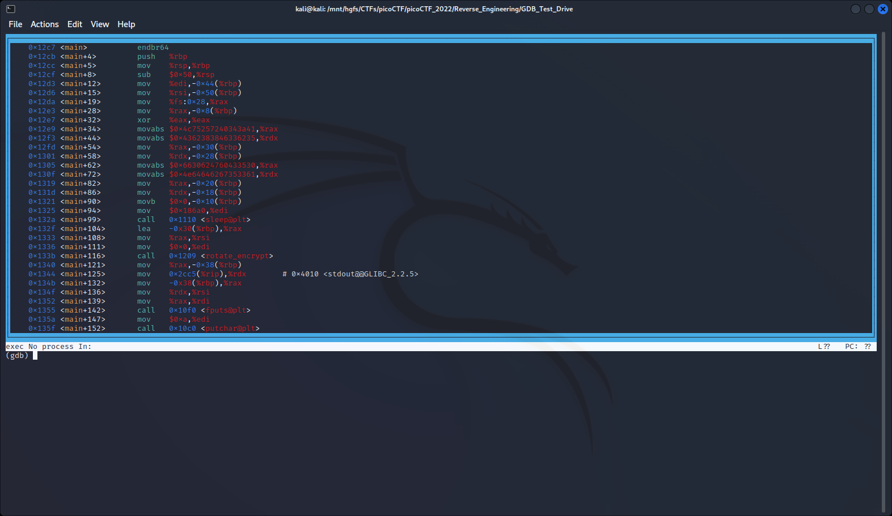

# GDB Test Drive

- [Challenge information](#challenge-information)
- [Solution](#solution)
- [References](#references)

## Challenge information
```
Points: 100
Tags: picoCTF 2022, Reverse Engineering, binary, gdb
Author: LT 'SYREAL' JONES

Description:
Can you get the flag?

Download this binary.

Here's the test drive instructions:
$ chmod +x gdbme
$ gdb gdbme
(gdb) layout asm
(gdb) break *(main+99)
(gdb) run
(gdb) jump *(main+104)

Hints:
(None)
```

## Solution

We just need to follow the given instructions.
First, make the file executable and start `gdb`
```bash
┌──(kali㉿kali)-[/picoCTF/picoCTF_2022/Reverse_Engineering/GDB_Test_Drive]
└─$ chmod +x gdbme 

┌──(kali㉿kali)-[/picoCTF/picoCTF_2022/Reverse_Engineering/GDB_Test_Drive]
└─$ gdb gdbme      
GNU gdb (Debian 12.1-4) 12.1
Copyright (C) 2022 Free Software Foundation, Inc.
License GPLv3+: GNU GPL version 3 or later <http://gnu.org/licenses/gpl.html>
This is free software: you are free to change and redistribute it.
There is NO WARRANTY, to the extent permitted by law.
Type "show copying" and "show warranty" for details.
This GDB was configured as "x86_64-linux-gnu".
Type "show configuration" for configuration details.
For bug reporting instructions, please see:
<https://www.gnu.org/software/gdb/bugs/>.
Find the GDB manual and other documentation resources online at:
    <http://www.gnu.org/software/gdb/documentation/>.

For help, type "help".
Type "apropos word" to search for commands related to "word"...
Reading symbols from gdbme...
(No debugging symbols found in gdbme)
```

When we issue `layout asm` we get a text based GUI-like window
```
(gdb) layout asm
```



Then we set a breakpoint on sleep and run the program
```
(gdb) break *(main+99)
(gdb) run
```

The program is now sleeping but we can force it out of the sleep by setting the instruction pointer 
to the next instruction after the sleep. This will continue the program and print the flag (not shown here).
```
(gdb) jump *(main+104)
```

For more information on GDB, please see the references below.

## References

- [The GDB developer's GNU Debugger tutorial, Part 1: Getting started with the debugger](https://developers.redhat.com/blog/2021/04/30/the-gdb-developers-gnu-debugger-tutorial-part-1-getting-started-with-the-debugger)
- [Tutorials Point - GNU Debugger Tutorial](https://www.tutorialspoint.com/gnu_debugger/index.htm)
