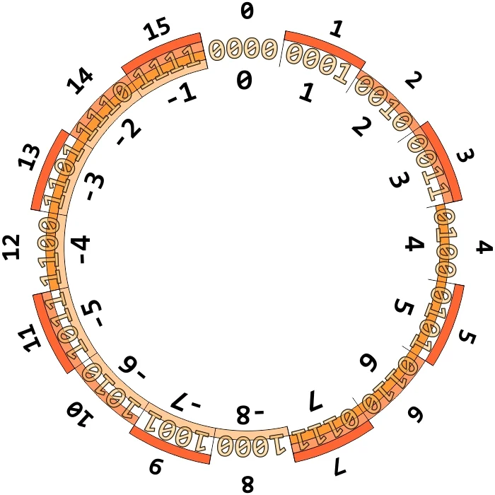

# two-sum

- [Challenge information](#challenge-information)
- [Solution](#solution)
- [References](#references)

## Challenge information
```
Points: 100
Tags: picoCTF 2023, Binary Exploitation, C, make
Author: MUBARAK MIKAIL

Description:

Can you solve this?

What two positive numbers can make this possible: n1 > n1 + n2 OR n2 > n1 + n2

Enter them here nc saturn.picoctf.net 57782.
 
Hints:
1. Integer overflow
2. Not necessarily a math problem
```

## Solution

### Understanding two's complement

To solve this challenge we need to understand the way signed integer numbers are stored - as [Two's complement](https://en.wikipedia.org/wiki/Two%27s_complement).

To illustrate this we can look at a very small number consisting only of 4 bits.



As we can see in the picture, if we continue to increase the value of the number when it is `7` it will "wrap around" and become `-8`.  
The number has [overflowed](https://en.wikipedia.org/wiki/Integer_overflow).

### Analyse the C file

With this small background in mind, lets look at the C source code starting with the `main` function
```c
int main() {
    int num1, num2, sum;
    FILE *flag;
    char c;

    printf("n1 > n1 + n2 OR n2 > n1 + n2 \n");
    fflush(stdout);
    printf("What two positive numbers can make this possible: \n");
    fflush(stdout);
    
    if (scanf("%d", &num1) && scanf("%d", &num2)) {
        printf("You entered %d and %d\n", num1, num2);
        fflush(stdout);
        sum = num1 + num2;
        if (addIntOvf(sum, num1, num2) == 0) {
            printf("No overflow\n");
            fflush(stdout);
            exit(0);
        } else if (addIntOvf(sum, num1, num2) == -1) {
            printf("You have an integer overflow\n");
            fflush(stdout);
        }

        if (num1 > 0 || num2 > 0) {
            flag = fopen("flag.txt","r");
            if(flag == NULL){
                printf("flag not found: please run this on the server\n");
                fflush(stdout);
                exit(0);
            }
            char buf[60];
            fgets(buf, 59, flag);
            printf("YOUR FLAG IS: %s\n", buf);
            fflush(stdout);
            exit(0);
        }
    }
    return 0;
}
```

And then the `addIntOvf` function where the verification is done
```c
static int addIntOvf(int result, int a, int b) {
    result = a + b;
    if(a > 0 && b > 0 && result < 0)
        return -1;
    if(a < 0 && b < 0 && result > 0)
        return -1;
    return 0;
}
```

Here we see that there are two ways to get the flag:
1. Add two positive numbers which sum is negative
2. Add two negative numbers which sum is positive

The first way is the easiest to picture in your mind so lets go for that.

### Choose the numbers

Assuming it's a 32-bit machine, we can calculate the largest signed number in Python
```
┌──(kali㉿kali)-[/picoCTF/picoCTF_2023/Binary_Exploitation/two-sum]
└─$ python                                                 
Python 3.10.9 (main, Dec  7 2022, 13:47:07) [GCC 12.2.0] on linux
Type "help", "copyright", "credits" or "license" for more information.
>>> 2**31-1
2147483647
```

Lets take this as the first number and any rather small number, such as `1337`, as the second number.

Connect to the server and input the numbers
```
┌──(kali㉿kali)-[/picoCTF/picoCTF_2023/Binary_Exploitation/two-sum]
└─$ nc saturn.picoctf.net 57782
n1 > n1 + n2 OR n2 > n1 + n2 
What two positive numbers can make this possible: 
2147483647
1337
You entered 2147483647 and 1337
You have an integer overflow
YOUR FLAG IS: picoCTF{<REDACTED>}
```

For additional information, please see the references below.

## References

- [Wikipedia - Integer overflow](https://en.wikipedia.org/wiki/Integer_overflow)
- [Wikipedia - Two's complement](https://en.wikipedia.org/wiki/Two%27s_complement)
