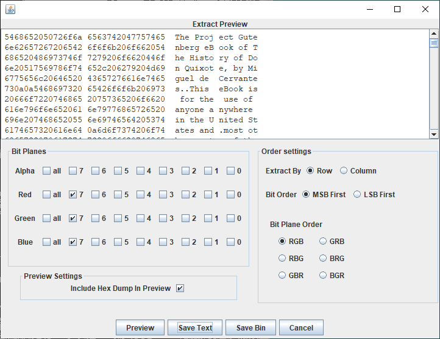

# MSB

- [Challenge information](#challenge-information)
- [Solution](#solution)
- [References](#references)

## Challenge information
```
Points: 200
Tags: picoCTF 2023, Forensics, steganography
Author: LT 'SYREAL' JONES

Description:
This image passes LSB statistical analysis, but we can't help but think there must be something 
to the visual artifacts present in this image...
Download the image here

Hints:
1. What's causing the 'corruption' of the image?
```
Challenge link: [https://play.picoctf.org/practice/challenge/359](https://play.picoctf.org/practice/challenge/359)

## Solution

From the challenge title and description we can deduce that this is going to be a [steganography](https://en.wikipedia.org/wiki/Steganography) challenge and that the encoding is probably going to be [most significant bit (MSB)](https://en.wikipedia.org/wiki/Bit_numbering).

### Basic analysis of the image file

Let's start with some basic analysis of the file
```bash
┌──(kali㉿kali)-[/mnt/…/picoCTF/picoCTF_2023/Forensics/MSB]
└─$ file Ninja-and-Prince-Genji-Ukiyoe-Utagawa-Kunisada.flag.png 
Ninja-and-Prince-Genji-Ukiyoe-Utagawa-Kunisada.flag.png: PNG image data, 1074 x 1500, 8-bit/color RGB, non-interlaced

┌──(kali㉿kali)-[/mnt/…/picoCTF/picoCTF_2023/Forensics/MSB]
└─$ pngcheck -v Ninja-and-Prince-Genji-Ukiyoe-Utagawa-Kunisada.flag.png         
zlib warning:  different version (expected 1.2.13, using 1.2.11)

File: Ninja-and-Prince-Genji-Ukiyoe-Utagawa-Kunisada.flag.png (3354311 bytes)
  chunk IHDR at offset 0x0000c, length 13
    1074 x 1500 image, 24-bit RGB, non-interlaced
  chunk IDAT at offset 0x00025, length 65536
    zlib: deflated, 32K window, default compression
  chunk IDAT at offset 0x10031, length 65536
  chunk IDAT at offset 0x2003d, length 65536
  chunk IDAT at offset 0x30049, length 65536
  chunk IDAT at offset 0x40055, length 65536
  chunk IDAT at offset 0x50061, length 65536
  chunk IDAT at offset 0x6006d, length 65536
  chunk IDAT at offset 0x70079, length 65536
  chunk IDAT at offset 0x80085, length 65536
  chunk IDAT at offset 0x90091, length 65536
  chunk IDAT at offset 0xa009d, length 65536
  chunk IDAT at offset 0xb00a9, length 65536
  chunk IDAT at offset 0xc00b5, length 65536
  chunk IDAT at offset 0xd00c1, length 65536
  chunk IDAT at offset 0xe00cd, length 65536
  chunk IDAT at offset 0xf00d9, length 65536
  chunk IDAT at offset 0x1000e5, length 65536
  chunk IDAT at offset 0x1100f1, length 65536
  chunk IDAT at offset 0x1200fd, length 65536
  chunk IDAT at offset 0x130109, length 65536
  chunk IDAT at offset 0x140115, length 65536
  chunk IDAT at offset 0x150121, length 65536
  chunk IDAT at offset 0x16012d, length 65536
  chunk IDAT at offset 0x170139, length 65536
  chunk IDAT at offset 0x180145, length 65536
  chunk IDAT at offset 0x190151, length 65536
  chunk IDAT at offset 0x1a015d, length 65536
  chunk IDAT at offset 0x1b0169, length 65536
  chunk IDAT at offset 0x1c0175, length 65536
  chunk IDAT at offset 0x1d0181, length 65536
  chunk IDAT at offset 0x1e018d, length 65536
  chunk IDAT at offset 0x1f0199, length 65536
  chunk IDAT at offset 0x2001a5, length 65536
  chunk IDAT at offset 0x2101b1, length 65536
  chunk IDAT at offset 0x2201bd, length 65536
  chunk IDAT at offset 0x2301c9, length 65536
  chunk IDAT at offset 0x2401d5, length 65536
  chunk IDAT at offset 0x2501e1, length 65536
  chunk IDAT at offset 0x2601ed, length 65536
  chunk IDAT at offset 0x2701f9, length 65536
  chunk IDAT at offset 0x280205, length 65536
  chunk IDAT at offset 0x290211, length 65536
  chunk IDAT at offset 0x2a021d, length 65536
  chunk IDAT at offset 0x2b0229, length 65536
  chunk IDAT at offset 0x2c0235, length 65536
  chunk IDAT at offset 0x2d0241, length 65536
  chunk IDAT at offset 0x2e024d, length 65536
  chunk IDAT at offset 0x2f0259, length 65536
  chunk IDAT at offset 0x300265, length 65536
  chunk IDAT at offset 0x310271, length 65536
  chunk IDAT at offset 0x32027d, length 65536
  chunk IDAT at offset 0x330289, length 11306
  chunk IEND at offset 0x332ebf, length 0
No errors detected in Ninja-and-Prince-Genji-Ukiyoe-Utagawa-Kunisada.flag.png (54 chunks, 30.6% compression).

┌──(kali㉿kali)-[/mnt/…/picoCTF/picoCTF_2023/Forensics/MSB]
└─$ exiftool Ninja-and-Prince-Genji-Ukiyoe-Utagawa-Kunisada.flag.png 
ExifTool Version Number         : 12.52
File Name                       : Ninja-and-Prince-Genji-Ukiyoe-Utagawa-Kunisada.flag.png
Directory                       : .
File Size                       : 3.4 MB
File Modification Date/Time     : 2023:10:01 02:52:46-04:00
File Access Date/Time           : 2023:10:01 03:11:04-04:00
File Inode Change Date/Time     : 2023:10:01 02:52:46-04:00
File Permissions                : -rwxrwxrwx
File Type                       : PNG
File Type Extension             : png
MIME Type                       : image/png
Image Width                     : 1074
Image Height                    : 1500
Bit Depth                       : 8
Color Type                      : RGB
Compression                     : Deflate/Inflate
Filter                          : Adaptive
Interlace                       : Noninterlaced
Image Size                      : 1074x1500
Megapixels                      : 1.6
```

Nope, nothing of interest as expected, but it's good to always double-check.

Let's bring out the stego-tools instead.

### Failed attempt with zsteg

The first tool tried was [zsteg](https://github.com/zed-0xff/zsteg) but that didn't yield anaything.  
The output with all tests was quite long so I grepped for the flag
```bash
┌──(kali㉿kali)-[/mnt/…/picoCTF/picoCTF_2023/Forensics/MSB]
└─$ zsteg -a Ninja-and-Prince-Genji-Ukiyoe-Utagawa-Kunisada.flag.png | grep -i pico

┌──(kali㉿kali)-[/mnt/…/picoCTF/picoCTF_2023/Forensics/MSB]
└─$ 
```
but there was no success.

### StegoVeritas solution

Next, I tried [stegoVeritas](https://github.com/bannsec/stegoVeritas).
```bash
┌──(kali㉿kali)-[/mnt/…/picoCTF/picoCTF_2023/Forensics/MSB]
└─$ ~/python_venvs/stegoveritas/bin/stegoveritas Ninja-and-Prince-Genji-Ukiyoe-Utagawa-Kunisada.flag.png 
Running Module: SVImage
+---------------------------+------+
|        Image Format       | Mode |
+---------------------------+------+
| Portable network graphics | RGB  |
+---------------------------+------+
Found something worth keeping!
ASCII text
+--------+------------------+-----------------------------------------------------------------------------------------------+-----------+
| Offset | Carved/Extracted | Description                                                                                   | File Name |
+--------+------------------+-----------------------------------------------------------------------------------------------+-----------+
| 0x460d | Carved           | LZMA compressed data, properties: 0xBE, dictionary size: 0 bytes, uncompressed size: 64 bytes | 460D.7z   |
| 0x460d | Extracted        | LZMA compressed data, properties: 0xBE, dictionary size: 0 bytes, uncompressed size: 64 bytes | 460D      |
+--------+------------------+-----------------------------------------------------------------------------------------------+-----------+
Found something worth keeping!
Common Data Format (Version 2.5 or earlier) data
Found something worth keeping!
Matlab v4 mat-file (little endian) UUUUUUUU, numeric, rows 4294967295, columns 4294967295
Running Module: MultiHandler

Found something worth keeping!
PNG image data, 1074 x 1500, 8-bit/color RGB, non-interlaced
+--------+------------------+-------------------------------------------+-----------+
| Offset | Carved/Extracted | Description                               | File Name |
+--------+------------------+-------------------------------------------+-----------+
| 0x29   | Carved           | Zlib compressed data, default compression | 29.zlib   |
| 0x29   | Extracted        | Zlib compressed data, default compression | 29        |
+--------+------------------+-------------------------------------------+-----------+
Exif
====
+---------------------+-----------------------------------------------------------------------------------------------------------+
| key                 | value                                                                                                     |
+---------------------+-----------------------------------------------------------------------------------------------------------+
| SourceFile          | /mnt/hgfs/CTFs/picoCTF/picoCTF_2023/Forensics/MSB/Ninja-and-Prince-Genji-Ukiyoe-Utagawa-Kunisada.flag.png |
| ExifToolVersion     | 12.52                                                                                                     |
| FileName            | Ninja-and-Prince-Genji-Ukiyoe-Utagawa-Kunisada.flag.png                                                   |
| Directory           | /mnt/hgfs/CTFs/picoCTF/picoCTF_2023/Forensics/MSB                                                         |
| FileSize            | 3.4 MB                                                                                                    |
| FileModifyDate      | 2023:10:01 02:52:46-04:00                                                                                 |
| FileAccessDate      | 2023:10:01 03:11:04-04:00                                                                                 |
| FileInodeChangeDate | 2023:10:01 02:52:46-04:00                                                                                 |
| FilePermissions     | -rwxrwxrwx                                                                                                |
| FileType            | PNG                                                                                                       |
| FileTypeExtension   | png                                                                                                       |
| MIMEType            | image/png                                                                                                 |
| ImageWidth          | 1074                                                                                                      |
| ImageHeight         | 1500                                                                                                      |
| BitDepth            | 8                                                                                                         |
| ColorType           | RGB                                                                                                       |
| Compression         | Deflate/Inflate                                                                                           |
| Filter              | Adaptive                                                                                                  |
| Interlace           | Noninterlaced                                                                                             |
| ImageSize           | 1074x1500                                                                                                 |
| Megapixels          | 1.6                                                                                                       |
+---------------------+-----------------------------------------------------------------------------------------------------------+
```

It found some interesting things and all the results were stored in the `results` subdirectory. 

If we recursively `grep` for the flag in that subdirectory, we find the flag
```bash
┌──(kali㉿kali)-[/mnt/…/picoCTF/picoCTF_2023/Forensics/MSB]
└─$ grep -iR 'picoCTF{' results
results/keepers/1696145860.1228228-58e497dde1fa38111f52be8cd01cdd8c:picoCTF{<REDACTED>}
```

### StegSolve solution

Alternatively, we can use the [stegsolve](https://github.com/Giotino/stegsolve) tool.

Open the image file and then select `Data Extract` in the `Analyse` menu.

The MSB-bit is bit 7 so select for Red, Green and Blue. The rest of the settings can be left as default.  
The press the `Preview`-button.

The result should look like this  


We can see readable text which is highly promising but browsing through the text we find no flag.  
This is because the text shown is only a subset of all the data.  
Press the `Save Text`-button to save all the extracted data as a file.

The saved file contains both hex and ascii values
```bash
┌──(kali㉿kali)-[/mnt/…/picoCTF/picoCTF_2023/Forensics/MSB]
└─$ head -3 StegSolve_all_text.data
5468652050726f6a 6563742047757465  The Proj ect Gute
6e62657267206542 6f6f6b206f662054  nberg eB ook of T
686520486973746f 7279206f6620446f  he Histo ry of Do
```
This makes grepping for the flag slightly more complicated. We cannot simply do a standard grep and expect to get the entire flag
```bash
┌──(kali㉿kali)-[/mnt/…/picoCTF/picoCTF_2023/Forensics/MSB]
└─$ grep pico StegSolve_all_text.data 
220a7069636f4354 467b31355f793075  ".picoCT F{15_y0u
```

But with a combination of `grep`, `cut` and `tr` you can get the full flag in readable form
```bash
┌──(kali㉿kali)-[/mnt/…/picoCTF/picoCTF_2023/Forensics/MSB]
└─$ grep -A3 pico StegSolve_all_text.data | cut -d ' ' -f3- | tr -d ' \n\r' 
".picoCTF{<REDACTED>}.."Thouhast   
```

### SigBits solution

Finally, you can use the [sigBits script](https://github.com/Pulho/sigBits) to extract the data.

Let's start by getting more information on the parameters we can and should use
```bash
┌──(kali㉿kali)-[/mnt/…/picoCTF/picoCTF_2023/Forensics/MSB]
└─$ ~/python_venvs/Pillow/bin/sigBits.py -h
Usage:
        sbPy [OPTIONS] [FILE]

Options:
        -t=<lsb or msb>, --type=<lsb or msb>:
                Choose between read LSB or MSB (Default is LSB)

        -o=<Order sigle>, --order=<Order sigle>:
                Read the lsb or msb in the specify order (Default is RGB)

        -out=<Ouput name>, --output=<Output name>
                Choose the name of the output file (Default is outputSB)

        -e=<Row r Column>, --extract=<Row or Column>
                Choose between extracting by row or column (Default is Column)

        -b=<7 bits of your choice>, --bits=<7 bits of your choice>
                Choose the bits you want to extract info ( Have higher priority than '--type or -t' )
```

Then we set the `type` to `MSB` and leave the rest as default
```bash
┌──(kali㉿kali)-[/mnt/…/picoCTF/picoCTF_2023/Forensics/MSB]
└─$ ~/python_venvs/Pillow/bin/sigBits.py -t=msb Ninja-and-Prince-Genji-Ukiyoe-Utagawa-Kunisada.flag.png 
Done, check the output file!
```
The output file is a file called `outputSB.txt`.

Since all the extracted data is stored in the same line, we need to use some [RegEx](https://en.wikipedia.org/wiki/Regular_expression) magic to extract only the flag
```bash
┌──(kali㉿kali)-[/mnt/…/picoCTF/picoCTF_2023/Forensics/MSB]
└─$ wc -l outputSB.txt 
1 outputSB.txt

┌──(kali㉿kali)-[/mnt/…/picoCTF/picoCTF_2023/Forensics/MSB]
└─$ grep -oE 'picoCTF{[^}]*}' outputSB.txt
picoCTF{<REDACTED>}
```

For additional information, please see the references below.

## References

- [sigBits - Github](https://github.com/Pulho/sigBits)
- [stegoVeritas - Github](https://github.com/bannsec/stegoVeritas)
- [stegsolve - Github](https://github.com/Giotino/stegsolve)
- [zsteg - Github](https://github.com/zed-0xff/zsteg)
- [cut - Linux manual page](https://man7.org/linux/man-pages/man1/cut.1.html)
- [grep - Linux manual page](https://man7.org/linux/man-pages/man1/grep.1.html)
- [tr - Linux manual page](https://man7.org/linux/man-pages/man1/tr.1.html)
- [wc - Linux manual page](https://man7.org/linux/man-pages/man1/wc.1.html)
- [Wikipedia - Bit numbering](https://en.wikipedia.org/wiki/Bit_numbering)
- [Wikipedia - Regular expression](https://en.wikipedia.org/wiki/Regular_expression)
- [Wikipedia - Steganography](https://en.wikipedia.org/wiki/Steganography)
