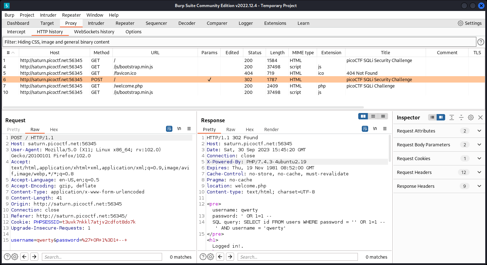

# More SQLi

- [Challenge information](#challenge-information)
- [Solution](#solution)
- [References](#references)

## Challenge information
```
Points: 200
Tags: picoCTF 2023, Web Exploitation, sql
Author: MUBARAK MIKAIL

Description:
Can you find the flag on this website.
Try to find the flag here.

Hints:
1. SQLiLite
```
Challenge link: [https://play.picoctf.org/practice/challenge/358](https://play.picoctf.org/practice/challenge/358)

## Solution

### Analyze the web page

Browse to the web site and we see a login form under the heading `Security Challenge`.  

The hint have already told us that we should expect a [SQL injection](https://en.wikipedia.org/wiki/SQL_injection) vulnerability  
but let's try to login with `admin:admin` and see what happens. The following is returned to us
```
username: admin
password: admin
SQL query: SELECT id FROM users WHERE password = 'admin' AND username = 'admin'
```

Yes, definitely SQL injection. 

### Log in with SQLi

OK, let's use the SQLi vulnerability by logging in with username `qwerty` and password `' OR 1=1 -- `.
We get a table but no flag visible.

Next, I checked if the flag was hidden in a HTML-comment, but no...

### Get the flag

However, when I checked the `HTTP history` in [Burp suite](https://portswigger.net/burp) that I had running in the background I finally found the flag in the `POST` response.



For additional information, please see the references below.

## References

- [Burp suite - Home page](https://portswigger.net/burp)
- [Wikipedia - SQL injection](https://en.wikipedia.org/wiki/SQL_injection)
