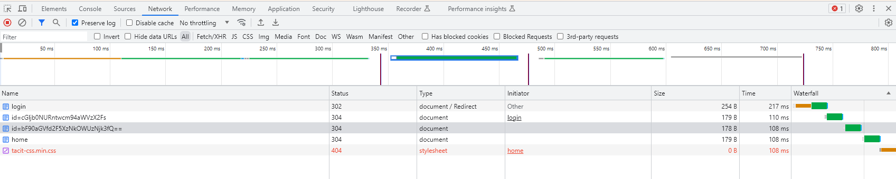

# findme

- [Challenge information](#challenge-information)
- [Solution](#solution)
- [References](#references)

## Challenge information
```
Points: 100
Tags: picoCTF 2023, Web Exploitation
Author: GEOFFREY NJOGU

Description:
Help us test the form by submiting the username as test and password as test!

The website running here.

Hints:
1. any redirections?
```
Challenge link: [https://play.picoctf.org/practice/challenge/349](https://play.picoctf.org/practice/challenge/349)

## Solution

Browse to the web site but before you login start DevTools in your browser (press F12) and navigate to the `Network` tab as the hint wants us to look for redirections. 
In the `Network`tab make sure you have the `Preserve Log` option enabled.

Then login with `test:test!`.

You will indeed see a number of redirections. [HTTP status codes](https://developer.mozilla.org/en-US/docs/Web/HTTP/Status) in the 3xx range are redirections.



One of the `id` parameters ends with two equal signs so they are both probably base64 encoded. The '=' is padding in base64.

Let's try to decode it to verify
```
┌──(kali㉿kali)-[/picoCTF/picoCTF_2023/Web_Explotation/findme]
└─$ echo "cGljb0NURntwcm94aWVzX2Fs" | base64 -d
picoCTF{proxies_al  
```

Combine the parameters and you have the flag.

For additional information, please see the references below.

## References

- [base64 - Linux manual page](https://man7.org/linux/man-pages/man1/base64.1.html)
- [HTTP status codes](https://developer.mozilla.org/en-US/docs/Web/HTTP/Status)
