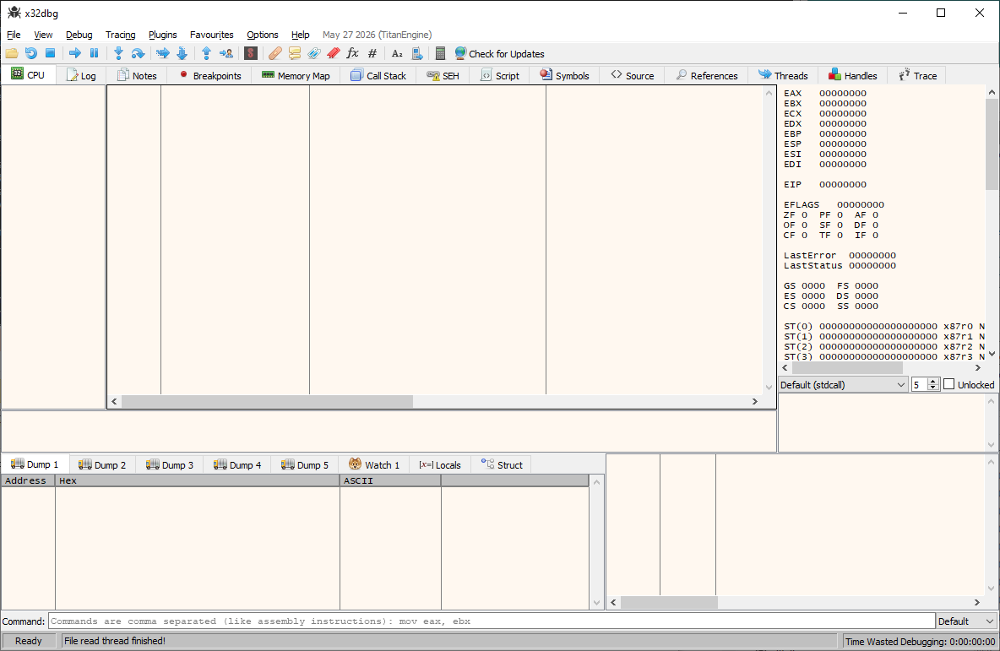
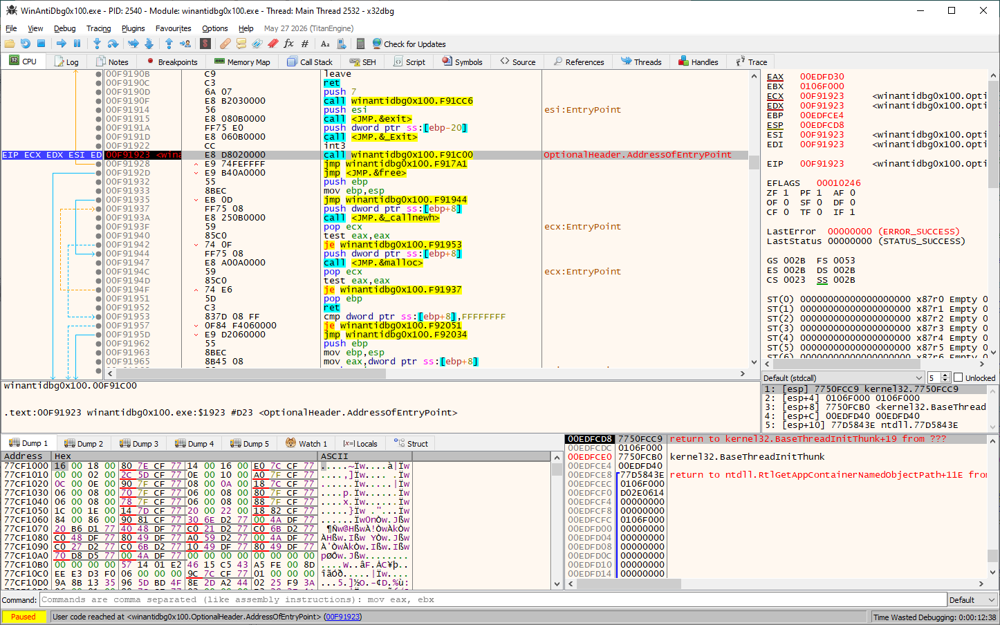
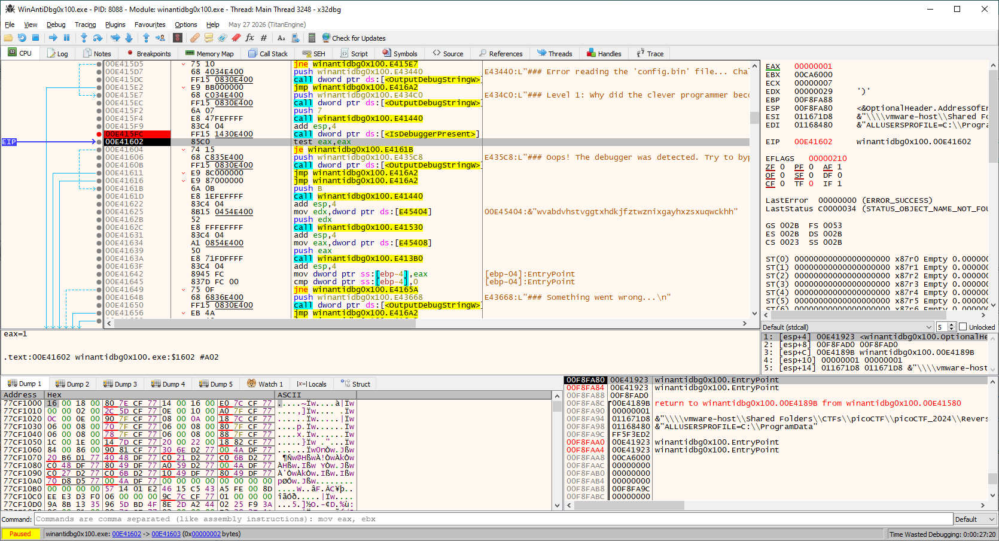
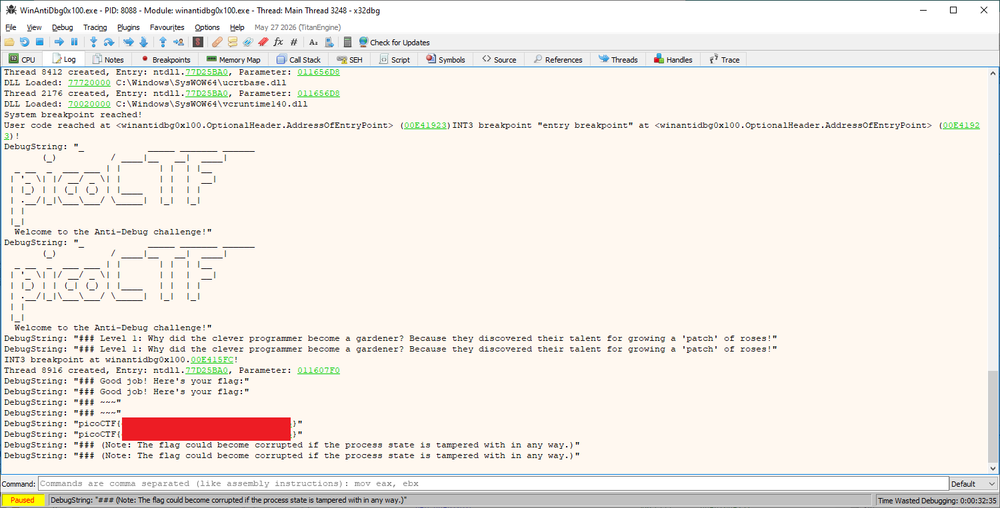

# WinAntiDbg0x100

- [Challenge information](#challenge-information)
- [Solution](#solution)
- [References](#references)

## Challenge information

```text
Level: Medium
Points: 200
Tags: picoCTF 2024, Reverse Engineering, windows
Meta Tags: Walkthrough, Walk-through, Write-up, Writeup
Author: Nandan Desai
 
Description:
This challenge will introduce you to 'Anti-Debugging.' Malware developers don't like it when you attempt to debug 
their executable files because debugging these files reveals many of their secrets! That's why, they include a lot 
of code logic specifically designed to interfere with your debugging process.

Now that you've understood the context, go ahead and debug this Windows executable!

This challenge binary file is a Windows console application and you can start with running it using cmd on Windows.

Challenge can be downloaded here. Unzip the archive with the password picoctf
 
Hints:
1. Hints will be displayed to the Debug console. Good luck!
```

Challenge link: [https://learn.cylabacademy.org/library/429](https://learn.cylabacademy.org/library/429)

## Solution

### Basic file analysis

We start with some basic analysis of the file

```bash
┌──(kali㉿kali)-[/mnt/…/picoCTF/picoCTF_2024/Reverse_Engineering/WinAntiDbg0x100]
└─$ unzip WinAntiDbg0x100.zip    
Archive:  WinAntiDbg0x100.zip
[WinAntiDbg0x100.zip] WinAntiDbg0x100.exe password: 
  inflating: WinAntiDbg0x100.exe     
 extracting: config.bin              

┌──(kali㉿kali)-[/mnt/…/picoCTF/picoCTF_2024/Reverse_Engineering/WinAntiDbg0x100]
└─$ ls -la
total 22
drwxrwxrwx 1 root root     0 Jul 13 16:08 .
drwxrwxrwx 1 root root     0 Jul 13 15:57 ..
-rwxrwxrwx 1 root root    88 Apr  2  2024 config.bin
-rwxrwxrwx 1 root root 14336 Feb  7  2024 WinAntiDbg0x100.exe
-rwxrwxrwx 1 root root  7523 Jul 13 16:01 WinAntiDbg0x100.zip

┌──(kali㉿kali)-[/mnt/…/picoCTF/picoCTF_2024/Reverse_Engineering/WinAntiDbg0x100]
└─$ file WinAntiDbg0x100.exe 
WinAntiDbg0x100.exe: PE32 executable (console) Intel 80386, for MS Windows, 5 sections

┌──(kali㉿kali)-[/mnt/…/picoCTF/picoCTF_2024/Reverse_Engineering/WinAntiDbg0x100]
└─$ cat config.bin                                                         
)wotnwhtxmhslfcmbdvrefbeluclydfvqljgvihpft,&"A  F9C;0
                                                     :^
                                                       WJ@<GKRO                                                                                                                                                                                                                               
┌──(kali㉿kali)-[/mnt/…/picoCTF/picoCTF_2024/Reverse_Engineering/WinAntiDbg0x100]
└─$ strings -n 6 WinAntiDbg0x100.exe               
!This program cannot be run in DOS mode.
`.rdata
@.data
@.reloc
t0hH3@
Unknown exception
bad allocation
bad array new length
        _            _____ _______ ______  
       (_)          / ____|__   __|  ____| 
  _ __  _  ___ ___ | |       | |  | |__    
 | '_ \| |/ __/ _ \| |       | |  |  __|   
 | |_) | | (_| (_) | |____   | |  | |      
 | .__/|_|\___\___/ \_____|  |_|  |_|      
 | |                                       
 |_|                                       
  Welcome to the Anti-Debug challenge!
NtQueryInformationProcess
%s\config.bin
### To start the challenge, you'll need to first launch this program using a debugger!
.text$mn
<---snip--->
.rsrc$02
GetModuleFileNameA
MultiByteToWideChar
OutputDebugStringW
GetProcAddress
GetModuleHandleW
IsDebuggerPresent         <---- Note!
KERNEL32.dll
strrchr
<---snip--->
```

We have a 32-bit Windows binary (i.e. PE-file). Among the strings we note the `IsDebuggerPresent` function.

### Do a testrun without debugger

If we try to run the binary without a debugger we get this information

```bat
Z:\CTFs\picoCTF\picoCTF_2024\Reverse_Engineering\WinAntiDbg0x100>WinAntiDbg0x100.exe


        _            _____ _______ ______
       (_)          / ____|__   __|  ____|
  _ __  _  ___ ___ | |       | |  | |__
 | '_ \| |/ __/ _ \| |       | |  |  __|
 | |_) | | (_| (_) | |____   | |  | |
 | .__/|_|\___\___/ \_____|  |_|  |_|
 | |
 |_|
  Welcome to the Anti-Debug challenge!
### To start the challenge, you'll need to first launch this program using a debugger!

Z:\CTFs\picoCTF\picoCTF_2024\Reverse_Engineering\WinAntiDbg0x100>
```

### Decompile in Ghidra

Import the file in Ghidra and analyze it with the default settings.

Searching for strings we find the following promising one `### Good job! Here's your flag:\n` at address `0x004036a8`.

Goign to this address and using the XREF-function we end up in the function `FUN_00401580` which we rename as `Flag_function`.

```c
undefined4 Flag_function(void)

{
  uint uVar1;
  int iVar2;
  BOOL BVar3;
  LPWSTR lpOutputString;
  
  uVar1 = FUN_00401130();
  if ((uVar1 & 0xff) == 0) {
    FUN_00401060(PTR_s________________________(_)_/_____00405020);
    FUN_00401060(
                "### To start the challenge, you\'ll need to first launch this program using a debugger!\n"
                );
  }
  else {
    OutputDebugStringW(L"\n");
    OutputDebugStringW(L"\n");
    FUN_004011b0();
    iVar2 = FUN_00401200();
    if (iVar2 == 0) {
      OutputDebugStringW(L"### Error reading the \'config.bin\' file... Challenge aborted.\n");
    }
    else {
      OutputDebugStringW(
                        L"### Level 1: Why did the clever programmer become a gardener? Because they discovered their talent for growing a \'patch\' of roses!\n"
                        );
      FUN_00401440(7);
      BVar3 = IsDebuggerPresent();
      if (BVar3 == 0) {
        FUN_00401440(0xb);
        FUN_00401530(DAT_00405404);
        lpOutputString = FUN_004013b0(DAT_00405408);
        if (lpOutputString == (LPWSTR)0x0) {
          OutputDebugStringW(L"### Something went wrong...\n");
        }
        else {
          OutputDebugStringW(L"### Good job! Here\'s your flag:\n");
          OutputDebugStringW(L"### ~~~ ");
          OutputDebugStringW(lpOutputString);
          OutputDebugStringW(L"\n");
          OutputDebugStringW(
                            L"### (Note: The flag could become corrupted if the process state is tampered with in any way.)\n\n"
                            );
          free(lpOutputString);
        }
      }
      else {
        OutputDebugStringW(
                          L"### Oops! The debugger was detected. Try to bypass this check to get the flag!\n"
                          );
      }
    }
    free(DAT_00405410);
  }
  OutputDebugStringW(L"\n");
  OutputDebugStringW(L"\n");
  return 0;
}
```

### Debug the binary

Let's try running the binary again, but with a debugger this time. I used the 32-bit version of [x64dbg](https://x64dbg.com/)



In the `File`-menu we choose `Open` and select the binary. The binary is started in a paused-mode in `ntdll.dll`. This is uninteresting system code.

Select `Run to user code` in the `Debug`-menu or use `Alt`+`F9`.



We can use the same string search in the debugger and navigate to the function above by double-clicking on the string.

Let's set a breakpoint on the call to `IsDebuggerPresent` and `Run` the code with `F9`.

We need to run **twice** due to an `int3` break-to-debugger instruction in the code.

Now we are getting closer. But here we need to bypass the check.  
Use `Step over` (`F8`) once so we reach the `test eax, eax` instruction.



Change the `EAX`-register to `0` by double-clicking on it in the upper right corner.

### Get the flag

Then `Run` (`F9`) the code again and check the `Log` tab for the flag.



For additional information, please see the references below.

## References

- [Debugger - Wikipedia](https://en.wikipedia.org/wiki/Debugger)
- [Decompiler - Wikipedia](https://en.wikipedia.org/wiki/Decompiler)
- [file - Linux manual page](https://man7.org/linux/man-pages/man1/file.1.html)
- [Ghidra - GitHub](https://github.com/NationalSecurityAgency/ghidra)
- [Ghidra - Kali Tools](https://www.kali.org/tools/ghidra/)
- [Ghidra - Wikipedia](https://en.wikipedia.org/wiki/Ghidra)
- [IsDebuggerPresent function - Microsoft Learn](https://learn.microsoft.com/en-us/windows/win32/api/debugapi/nf-debugapi-isdebuggerpresent)
- [Portable Executable - Wikipedia](https://en.wikipedia.org/wiki/Portable_Executable)
- [strings - Linux manual page](https://man7.org/linux/man-pages/man1/strings.1.html)
- [unzip - Linux manual page](https://linux.die.net/man/1/unzip)
- [x64dbg - Homepage](https://x64dbg.com/)
