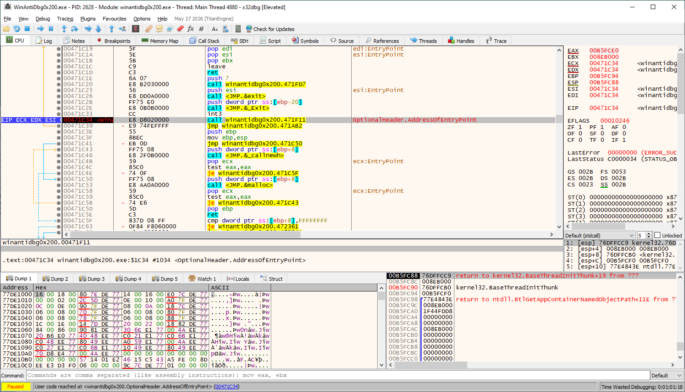
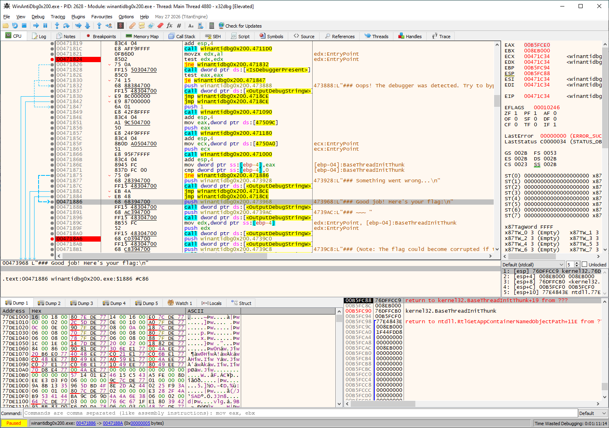
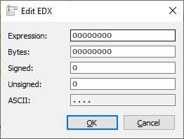
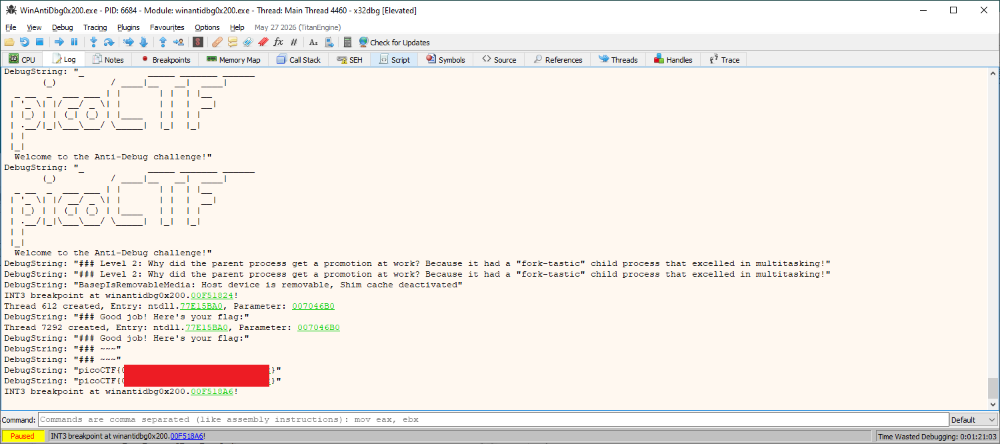

# WinAntiDbg0x200

- [Challenge information](#challenge-information)
- [Solution](#solution)
- [References](#references)

## Challenge information

```text
Level: Medium
Points: 300
Tags: picoCTF 2024, Reverse Engineering, windows
Meta Tags: Walkthrough, Walk-through, Write-up, Writeup
Author: Nandan Desai
 
Description:
If you have solved WinAntiDbg0x100, you'll discover something new in this one. Debug the executable and find the flag!

This challenge executable is a Windows console application, and you can start by running it using Command Prompt on Windows.

This executable requires admin privileges. You might want to start Command Prompt or your debugger using the 
'Run as administrator' option.

Challenge can be downloaded here. Unzip the archive with the password picoctf
 
Hints:
1. Hints will be displayed to the Debug console. Good luck!
```

Challenge link: [https://learn.cylabacademy.org/library/430](https://learn.cylabacademy.org/library/430)

## Solution

### Basic file analysis

We start with some basic analysis of the file

```bash
┌──(kali㉿kali)-[/mnt/…/picoCTF/picoCTF_2024/Reverse_Engineering/WinAntiDbg0x200]
└─$ unzip WinAntiDbg0x200.zip 
Archive:  WinAntiDbg0x200.zip
[WinAntiDbg0x200.zip] WinAntiDbg0x200.exe password: 
  inflating: WinAntiDbg0x200.exe     
 extracting: config.bin              

┌──(kali㉿kali)-[/mnt/…/picoCTF/picoCTF_2024/Reverse_Engineering/WinAntiDbg0x200]
└─$ file WinAntiDbg0x200.exe 
WinAntiDbg0x200.exe: PE32 executable (console) Intel 80386, for MS Windows, 5 sections

┌──(kali㉿kali)-[/mnt/…/picoCTF/picoCTF_2024/Reverse_Engineering/WinAntiDbg0x200]
└─$ strings -n 6 WinAntiDbg0x200.exe
!This program cannot be run in DOS mode.
Richd/
`.rdata
@.data
@.reloc
u%hH5@
        _            _____ _______ ______  
       (_)          / ____|__   __|  ____| 
  _ __  _  ___ ___ | |       | |  | |__    
 | '_ \| |/ __/ _ \| |       | |  |  __|   
 | |_) | | (_| (_) | |____   | |  | |      
 | .__/|_|\___\___/ \_____|  |_|  |_|      
 | |                                       
 |_|                                       
  Welcome to the Anti-Debug challenge!
NtQueryInformationProcess
%s\config.bin
[ERROR] OpenProcessToken failed, error %d
[ERROR] LookupPrivilegeValue failed, error %d
[ERROR] AdjustTokenPrivileges failed, error %d
[ERROR] SeDebugPrivilege not enabled for the current user.
%ws %d
[ERROR] There are permission issues. This program requires debug privileges and hence you might want to run it as an Admin.
Challenge aborted. Please run this program as an Admin. Exiting now...
[ERROR] Failed to create the Mutex. Exiting now...
[ERROR] Expected an argument
### To start the challenge, you'll need to first launch this program using a debugger!
Unknown exception
bad allocation
bad array new length
.text$mn
.idata$5
.00cfg
<---snip--->
IsDebuggerPresent
OutputDebugStringW
DebugActiveProcess
CloseHandle
GetLastError
WaitForSingleObject
CreateMutexW
GetCurrentProcess
GetCurrentProcessId
GetExitCodeProcess
CreateProcessA
GetModuleFileNameA
GetModuleFileNameW
GetModuleHandleW
GetProcAddress
MultiByteToWideChar
KERNEL32.dll
OpenProcessToken
AdjustTokenPrivileges
LookupPrivilegeValueW
ADVAPI32.dll
strrchr
memset
<---snip--->

┌──(kali㉿kali)-[/mnt/…/picoCTF/picoCTF_2024/Reverse_Engineering/WinAntiDbg0x200]
└─$ strings -n 6 -e l WinAntiDbg0x200.exe
jjjjjj
ntdll.dll
(Ignore) error related to Ntdll. Falling back.
SeDebugPrivilege
### [ERROR] Unable to create the child process. Assuming a debugger messed with it.
WinAntiDbg0x200
### Error reading the 'config.bin' file... Challenge aborted.
### Level 2: Why did the parent process get a promotion at work? Because it had a "fork-tastic" child process that excelled in multitasking!
### Oops! The debugger was detected. Try to bypass this check to get the flag!
### Something went wrong...
### Good job! Here's your flag:
### ~~~ 
### (Note: The flag could become corrupted if the process state is tampered with in any way.)
```

We have a 32-bit Windows binary (i.e. PE-file). From the strings we get the hint that we should look out for `forks` (child processes).

### Decompile in Ghidra

Import the file in Ghidra and analyze it with the default settings.

As in the [previous](WinAntiDbg0x100.md) challenge, we search for strings and go to the function were the unicode string `###_Good_job!_Here's_your_flag:` is used.

That function is called `FUN_004016e0` but we rename it `Flag_function`.

```c
undefined4 __cdecl Flag_function(int param_1,int param_2)

{
  char cVar1;
  int iVar2;
  HANDLE hObject;
  DWORD DVar3;
  BOOL BVar4;
  uint uVar5;
  LPWSTR lpOutputString;
  
  iVar2 = FUN_004012f0();
  if (iVar2 == 0) {
    FUN_00401910(
                "[ERROR] There are permission issues. This program requires debug privileges and hence you might want to run it as an Admin.\n"
                );
    FUN_00401910("Challenge aborted. Please run this program as an Admin. Exiting now...\n");
                    /* WARNING: Subroutine does not return */
    exit(0xff);
  }
  hObject = CreateMutexW((LPSECURITY_ATTRIBUTES)0x0,0,L"WinAntiDbg0x200");
  if (hObject == (HANDLE)0x0) {
    FUN_00401910("[ERROR] Failed to create the Mutex. Exiting now...\n");
                    /* WARNING: Subroutine does not return */
    exit(0xff);
  }
  DVar3 = GetLastError();
  if (DVar3 == 0xb7) {
    if (param_1 != 2) {
      FUN_00401910("[ERROR] Expected an argument\n");
                    /* WARNING: Subroutine does not return */
      exit(0xbeef);
    }
    DVar3 = atoi(*(char **)(param_2 + 4));
    BVar4 = DebugActiveProcess(DVar3);
    if (BVar4 != 0) {
                    /* WARNING: Subroutine does not return */
      exit(0);
    }
                    /* WARNING: Subroutine does not return */
    exit(0xbeef);
  }
  FUN_00401910(PTR_s________________________(_)_/_____00405000);
  uVar5 = FUN_00401600();
  if ((uVar5 & 0xff) == 0) {
    FUN_00401910(
                "### To start the challenge, you\'ll need to first launch this program using a debugger!\n"
                );
    goto LAB_004018de;
  }
  OutputDebugStringW(L"\n");
  OutputDebugStringW(L"\n");
  FUN_00401400();
  iVar2 = FUN_00401450();
  if (iVar2 == 0) {
    OutputDebugStringW(L"### Error reading the \'config.bin\' file... Challenge aborted.\n");
  }
  else {
    OutputDebugStringW(
                      L"### Level 2: Why did the parent process get a promotion at work? Because it had a \"fork-tastic\" child process that excelled in multitasking!\n"
                      );
    FUN_00401090(3);
    cVar1 = FUN_004011d0();
    if (cVar1 == '\0') {
      BVar4 = IsDebuggerPresent();
      if (BVar4 == 0) {
        FUN_00401090(1);
        FUN_00401180(DAT_0040509c);
        lpOutputString = FUN_00401000(DAT_004050a0);
        if (lpOutputString == (LPWSTR)0x0) {
          OutputDebugStringW(L"### Something went wrong...\n");
        }
        else {
          OutputDebugStringW(L"### Good job! Here\'s your flag:\n");
          OutputDebugStringW(L"### ~~~ ");
          OutputDebugStringW(lpOutputString);
          OutputDebugStringW(L"\n");
          OutputDebugStringW(
                            L"### (Note: The flag could become corrupted if the process state is tampered with in any way.)\n\n"
                            );
          free(lpOutputString);
        }
        goto LAB_004018ce;
      }
    }
    OutputDebugStringW(
                      L"### Oops! The debugger was detected. Try to bypass this check to get the flag!\n"
                      );
  }
LAB_004018ce:
  free(DAT_00405098);
LAB_004018de:
  CloseHandle(hObject);
  OutputDebugStringW(L"\n");
  OutputDebugStringW(L"\n");
  return 0;
}
```

In function `FUN_004011d0`, which we rename to `Fork_function`, we find a call to `CreateProcessA`.  
We find this function from the `Unable to create the child process.` string.

```c
undefined1 Fork_function(void)

{
  WCHAR local_380 [260];
  CHAR local_178 [272];
  _STARTUPINFOA local_68;
  BOOL local_24;
  DWORD local_20;
  _PROCESS_INFORMATION local_1c;
  DWORD local_c;
  undefined1 local_5;
  
  FUN_00401090(5);
  local_5 = 0;
  memset(&local_68,0,0x44);
  local_68.cb = 0x44;
  local_1c.hProcess = (HANDLE)0x0;
  local_1c.hThread = (HANDLE)0x0;
  local_1c.dwProcessId = 0;
  local_1c.dwThreadId = 0;
  local_c = 0;
  local_20 = GetCurrentProcessId();
  GetModuleFileNameW((HMODULE)0x0,local_380,0x104);
  FUN_00401950(local_178,0x110,"%ws %d");
  local_24 = CreateProcessA((LPCSTR)0x0,local_178,(LPSECURITY_ATTRIBUTES)0x0,
                            (LPSECURITY_ATTRIBUTES)0x0,0,0,(LPVOID)0x0,(LPCSTR)0x0,&local_68,
                            &local_1c);
  if (local_24 == 0) {
    OutputDebugStringW(
                      L"### [ERROR] Unable to create the child process. Assuming a debugger messed with it.\n"
                      );
    local_5 = 1;
  }
  else {
    WaitForSingleObject(local_1c.hProcess,0xffffffff);
    FUN_00401090(4);
    GetExitCodeProcess(local_1c.hProcess,&local_c);
    CloseHandle(local_1c.hProcess);
    CloseHandle(local_1c.hThread);
    FUN_00401090(4);
    if (local_c == 0xbeef) {
      local_5 = 1;
    }
  }
  return local_5;
}
```

Now that we have an overview of the code, let's dive into the details.

### Debug the binary

Next we run the binary in a debugger. I used the 32-bit version of [x64dbg](https://x64dbg.com/). Select `Restart as Admin` in the `File`-menu.

In the `File`-menu we choose `Open` and select the binary. The binary is started in a paused-mode in `ntdll.dll`. This is uninteresting system code.

Select `Run to user code` in the `Debug`-menu or use `Alt`+`F9`.



We can use a string search as in the decompiler and navigate to the function above by double-clicking on the string.  
Press the `Az`-icon to `Find Strings` and double-click on `### Good job! Here's your flag:\n`.

Here we should set two breakpoints:

- At the `test edx, edx` instruction before the debugger tests start
- At the `push` instruction after the flag is printed to the log.

See view below:



Then `Run` (`F9`) the binary until the first breakpoint is hit. A couple of Runs are needed due to the debugger also stops after the `int3` instruction.

### Bypass the checks

As in the previous challenge, we now need to bypass **two checks** by modifying registers.

In the first check, set `EDX` to `0` by double-clicking on it and change the value.



Then `Step Over` (`F8`) the code until you reach the second check (`test eax, eax`).  
Change the `EAX`-register to `0` in a same manner.

### Get the flag

Finally, `Run` (`F9`) the code again and check the `Log` tab for the flag.



For additional information, please see the references below.

## References

- [CreateProcessA function - Microsoft Learn](https://learn.microsoft.com/en-us/windows/win32/api/processthreadsapi/nf-processthreadsapi-createprocessa)
- [Debugger - Wikipedia](https://en.wikipedia.org/wiki/Debugger)
- [Decompiler - Wikipedia](https://en.wikipedia.org/wiki/Decompiler)
- [file - Linux manual page](https://man7.org/linux/man-pages/man1/file.1.html)
- [Ghidra - GitHub](https://github.com/NationalSecurityAgency/ghidra)
- [Ghidra - Kali Tools](https://www.kali.org/tools/ghidra/)
- [Ghidra - Wikipedia](https://en.wikipedia.org/wiki/Ghidra)
- [INT3 instruction - Wikipedia](https://en.wikipedia.org/wiki/INT_(x86_instruction)#INT3)
- [IsDebuggerPresent function - Microsoft Learn](https://learn.microsoft.com/en-us/windows/win32/api/debugapi/nf-debugapi-isdebuggerpresent)
- [Portable Executable - Wikipedia](https://en.wikipedia.org/wiki/Portable_Executable)
- [strings - Linux manual page](https://man7.org/linux/man-pages/man1/strings.1.html)
- [Unicode - Wikipedia](https://en.wikipedia.org/wiki/Unicode)
- [unzip - Linux manual page](https://linux.die.net/man/1/unzip)
- [x64dbg - Homepage](https://x64dbg.com/)
