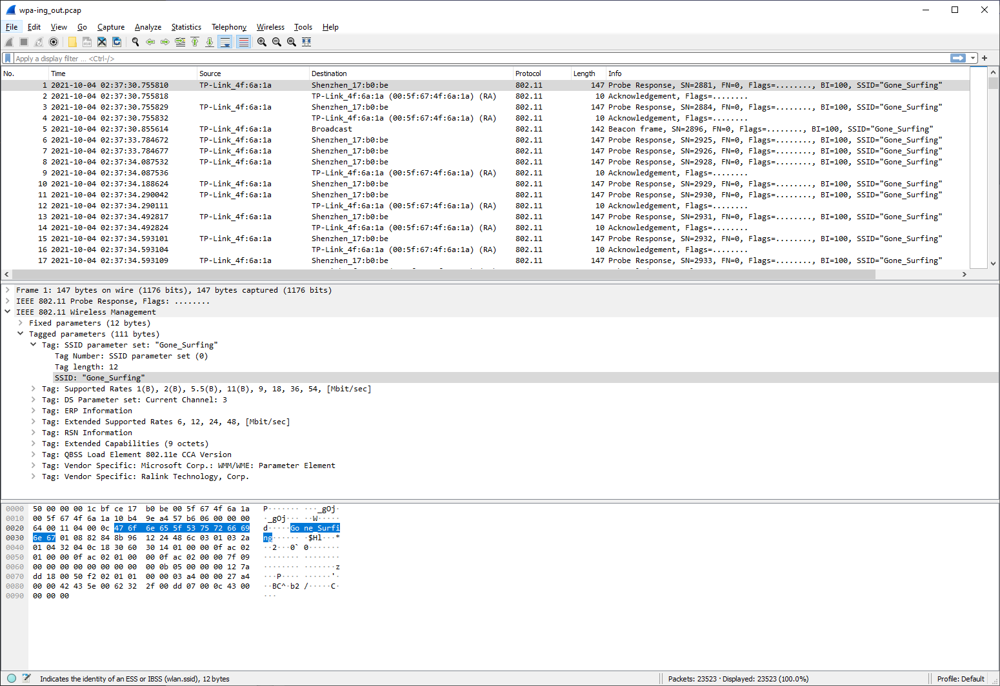

# WPA-ing Out

- [Challenge information](WPA-ing_Out.md#challenge-information)
- [Solution](WPA-ing_Out.md#solution)

## Challenge information
```
Points: 200
Tags: picoGym Exclusive, Forensics
Author: MISTRESSVAMPY

Description:
I thought that my password was super-secret, but it turns out that passwords passed over the AIR can be CRACKED,  
especially if I used the same wireless network password as one in the rockyou.txt credential dump.

Use this 'pcap file' and the rockyou wordlist. The flag should be entered in the picoCTF{XXXXXX} format.

Hints:
1. Finding the IEEE 802.11 wireless protocol used in the wireless traffic packet capture is easier with wireshark,  
   the JAWS of the network.
2. Aircrack-ng can make a pcap file catch big air...and crack a password.
```

## Solution

### Find out the name of the network, the SSID

You probably could get away with cracking all the SSIDs in the PCAP file but lets make the cracking more 
targeted by finding out the SSIDs in the PCAP. We do this for learning in two steps:
1. Finding out the name of the SSID field in Wireshark
2. Listing all the SSID names in `tshark` (the commandline version of Wireshark)

First open the PCAP-file in [Wireshark](https://www.wireshark.org/) and expand the properties of the first packet.



In the status bar at the bottom of the window you can see that the field name for the SSID is `wlan.ssid`.
Now we have the name of the SSID field.

Then lets find out if there are any packets from other networks contained in the PCAP. For this we use `tshark`.
We only want to output the `wlan.ssid` field so we change the output to specific fields (-T fields) and
specify our wanted field with -e. 

We also sort the output from `tshark` with a GNU-unix port of sort called `gsort` from [GnuWin32](https://getgnuwin32.sourceforge.net/).  
Output only a unique list with the -u parameter.
```
Z:\CTFs\picoCTF\picoGym\Forensics\WPA-ing_Out>tshark -r wpa-ing_out.pcap -T fields -e wlan.ssid | gsort -u

476f6e655f53757266696e67
```

Oh, the output is in hex. I couldn't find any `tshark` parameter to change this so I used `xxd` instead to reverse the hexdump (-r)  
and output the text in plain format (-p).
```
Z:\CTFs\picoCTF\picoGym\Forensics\WPA-ing_Out> tshark -r wpa-ing_out.pcap -T fields -e wlan.ssid | gsort -u | xxd -r -p
Gone_Surfing
```

Much better! And 'Gone_Surfing' is the only network contained in the PCAP.

### Crack the password

For cracking I used [aircrack-ng](https://aircrack-ng.org/) together with the rockyou wordlist. The wordlist is included in the [Leaked-Databases section](https://github.com/danielmiessler/SecLists/tree/master/Passwords/Leaked-Databases) of Daniel Miessler's SecLists if you don't have it already.

Specify the SSID and the wordlist like this
```
Z:\CTFs\picoCTF\picoGym\Forensics\WPA-ing_Out>aircrack-ng -e Gone_Surfing -w C:\Sec-Lists\Passwords\Leaked-Databases\rockyou.txt wpa-ing_out.pcap
```

Then password is found very fast and is redacted below.
```
                               Aircrack-ng 1.6

      [00:00:04] 1309/14344391 keys tested (292.73 k/s)

      Time left: 13 hours, 38 minutes, 40 seconds                0.01%

                          KEY FOUND! [ <REDACTED> ]


      Master Key     : 4B 09 F8 03 77 6A 36 B0 6D 45 9E FC F0 B1 05 69
                       03 DD BC 71 E2 2A CE 4E C4 79 FA AF CB CC C7 F2

      Transient Key  : A3 A3 A3 A3 A3 A3 A3 A3 6A 67 C4 76 95 75 A6 09
                       BF 0E 6E E9 BC 90 73 44 22 CE 81 80 B7 84 0E 0D
                       7D FF B4 7E 0A 9C EE F3 B6 AA BB ED 93 EF 79 25
                       2B A9 21 97 45 C2 27 5D 5E E9 1F 1F D5 07 FB 8E

      EAPOL HMAC     : C5 46 D2 AF 2E 21 BC 3E 0D 3E F4 6E 10 AB BA DA
```

### Create the flag

The flag consists of the password in the standard flag format, i.e. `picoCTF{<The password>}`.
