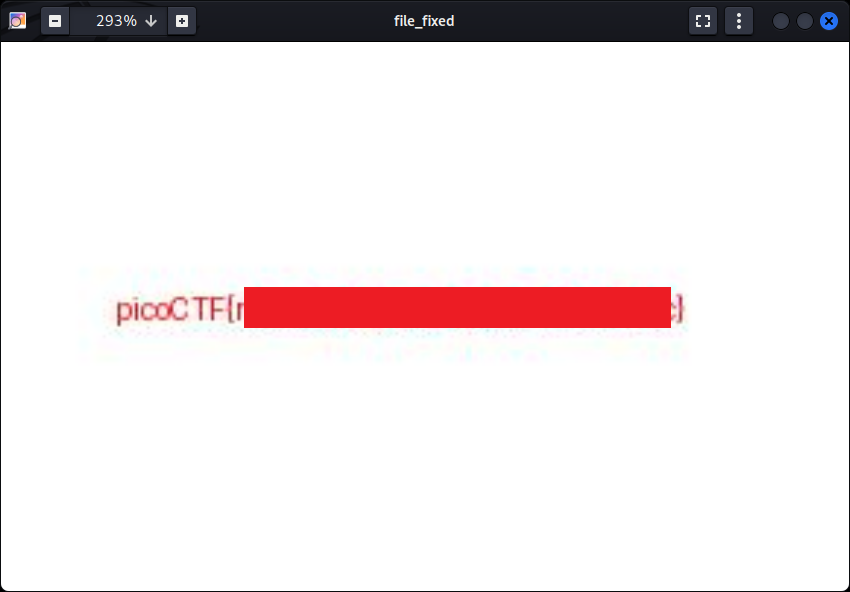

# Corrupted file

- [Challenge information](#challenge-information)
- [Solution](#solution)
- [References](#references)

## Challenge information

```text
Level: Easy
Points: 100
Tags: Forensics, picoMini by CMU-Africa, browser_webshell_solvable
Meta Tags: Walkthrough, Walk-through, Write-up, Writeup
Author: Yahaya Meddy

Description:
This file seems broken... or is it? Maybe a couple of bytes could make all the difference. 
Can you figure out how to bring it back to life?

Download the file here.

Hints:
1. Try checking the file’s header.
2. JPEG
3. Tools like xxd or hexdump can help you inspect and edit file bytes.
```

Challenge link: [https://learn.cylabacademy.org/library/519](https://learn.cylabacademy.org/library/519)

## Solution

### Basic file analysis

We start with some basic file analysis of the file.

```bash
┌──(kali㉿kali)-[/mnt/…/picoCTF/picoMini_by_CMU-Africa/Forensics/Corrupted_file]
└─$ file file              
file: data

┌──(kali㉿kali)-[/mnt/…/picoCTF/picoMini_by_CMU-Africa/Forensics/Corrupted_file]
└─$ xxd -l 128 file    
00000000: 5c78 ffe0 0010 4a46 4946 0001 0100 0001  \x....JFIF......
00000010: 0001 0000 ffdb 0043 0008 0606 0706 0508  .......C........
00000020: 0707 0709 0908 0a0c 140d 0c0b 0b0c 1912  ................
00000030: 130f 141d 1a1f 1e1d 1a1c 1c20 242e 2720  ........... $.' 
00000040: 222c 231c 1c28 3729 2c30 3134 3434 1f27  ",#..(7),01444.'
00000050: 393d 3832 3c2e 3334 32ff db00 4301 0909  9=82<.342...C...
00000060: 090c 0b0c 180d 0d18 3221 1c21 3232 3232  ........2!.!2222
00000070: 3232 3232 3232 3232 3232 3232 3232 3232  2222222222222222
```

We can see that the [magic bytes](https://en.wikipedia.org/wiki/File_format#Magic_number) for this file is `5c 78 ff e0`.

The normal [file signature](https://en.wikipedia.org/wiki/List_of_file_signatures) for JPEG is `ff d8 ff e0`.

Before we do any modifications, we take a working copy.

```bash
┌──(kali㉿kali)-[/mnt/…/picoCTF/picoMini_by_CMU-Africa/Forensics/Corrupted_file]
└─$ cp file file_fixed 

┌──(kali㉿kali)-[/mnt/…/picoCTF/picoMini_by_CMU-Africa/Forensics/Corrupted_file]
└─$ 
```

### Fix the image

Let's overwrite the first two bytes with the correct ones with `dd`.

```bash
┌──(kali㉿kali)-[/mnt/…/picoCTF/picoMini_by_CMU-Africa/Forensics/Corrupted_file]
└─$ echo -en '\xFF\xD8' | dd of=file_fixed bs=2 conv=notrunc 
1+0 records in
1+0 records out
2 bytes copied, 0.000926384 s, 2.2 kB/s

┌──(kali㉿kali)-[/mnt/…/picoCTF/picoMini_by_CMU-Africa/Forensics/Corrupted_file]
└─$ xxd -l 128 file_fixed                                   
00000000: ffd8 ffe0 0010 4a46 4946 0001 0100 0001  ......JFIF......
00000010: 0001 0000 ffdb 0043 0008 0606 0706 0508  .......C........
00000020: 0707 0709 0908 0a0c 140d 0c0b 0b0c 1912  ................
00000030: 130f 141d 1a1f 1e1d 1a1c 1c20 242e 2720  ........... $.' 
00000040: 222c 231c 1c28 3729 2c30 3134 3434 1f27  ",#..(7),01444.'
00000050: 393d 3832 3c2e 3334 32ff db00 4301 0909  9=82<.342...C...
00000060: 090c 0b0c 180d 0d18 3221 1c21 3232 3232  ........2!.!2222
00000070: 3232 3232 3232 3232 3232 3232 3232 3232  2222222222222222

┌──(kali㉿kali)-[/mnt/…/picoCTF/picoMini_by_CMU-Africa/Forensics/Corrupted_file]
└─$ file file_fixed 
file_fixed: JPEG image data, JFIF standard 1.01, aspect ratio, density 1x1, segment length 16, baseline, precision 8, 800x500, components 3
```

Looks good!

### Get the flag

To view the fixed image and get the flag we can use either `eog` or `feh`.



For additional information, please see the references below.

## References

- [dd - Linux manual page](https://man7.org/linux/man-pages/man1/dd.1.html)
- [echo - Linux manual page](https://man7.org/linux/man-pages/man1/echo.1.html)
- [file - Linux manual page](https://man7.org/linux/man-pages/man1/file.1.html)
- [JPEG - Wikipedia](https://en.wikipedia.org/wiki/JPEG)
- [List of file signatures - Wikipedia](https://en.wikipedia.org/wiki/List_of_file_signatures)
- [Magic Bytes - Wikipedia](https://en.wikipedia.org/wiki/File_format#Magic_number)
- [xxd - Linux manual page](https://linux.die.net/man/1/xxd)
