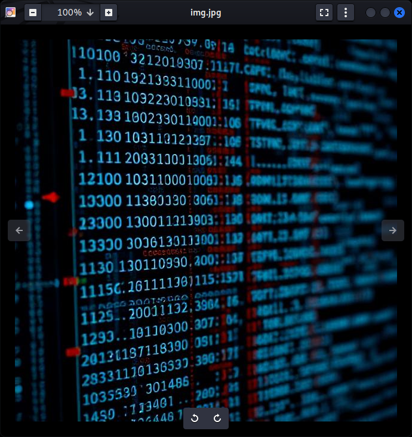

# Hidden in plainsight

- [Challenge information](#challenge-information)
- [Solution](#solution)
- [References](#references)

## Challenge information

```text
Level: Easy
Points: 100
Tags: Forensics, picoMini by CMU-Africa, browser_webshell_solvable
Meta Tags: Walkthrough, Walk-through, Write-up, Writeup
Author: Yahaya Meddy

Description:
You’re given a seemingly ordinary JPG image. Something is tucked away out of sight inside the file. 
Your task is to discover the hidden payload and extract the flag.

Download the jpg image here.

Hints:
1. Download the jpg image and read its metadata
```

Challenge link: [https://learn.cylabacademy.org/library/524](https://learn.cylabacademy.org/library/524)

## Solution

### Basic file analysis

We start with some basic file analysis of the image.

```bash
┌──(kali㉿kali)-[/mnt/…/picoCTF/picoMini_by_CMU-Africa/Forensics/Hidden_in_plainsight]
└─$ file img.jpg         
img.jpg: JPEG image data, JFIF standard 1.01, aspect ratio, density 1x1, segment length 16, comment: "c3RlZ2hpZGU6Y0VGNmVuZHZjbVE9", baseline, precision 8, 640x640, components 3

┌──(kali㉿kali)-[/mnt/…/picoCTF/picoMini_by_CMU-Africa/Forensics/Hidden_in_plainsight]
└─$ exiftool img.jpg                                
ExifTool Version Number         : 13.50
File Name                       : img.jpg
Directory                       : .
File Size                       : 73 kB
File Modification Date/Time     : 2026:07:16 07:16:33+02:00
File Access Date/Time           : 2026:07:16 07:17:01+02:00
File Inode Change Date/Time     : 2026:07:16 07:16:33+02:00
File Permissions                : -rwxrwxrwx
File Type                       : JPEG
File Type Extension             : jpg
MIME Type                       : image/jpeg
JFIF Version                    : 1.01
Resolution Unit                 : None
X Resolution                    : 1
Y Resolution                    : 1
Comment                         : c3RlZ2hpZGU6Y0VGNmVuZHZjbVE9
Image Width                     : 640
Image Height                    : 640
Encoding Process                : Baseline DCT, Huffman coding
Bits Per Sample                 : 8
Color Components                : 3
Y Cb Cr Sub Sampling            : YCbCr4:2:0 (2 2)
Image Size                      : 640x640
Megapixels                      : 0.410
```

The Comment field look strange, like [Base64-encoded]((https://en.wikipedia.org/wiki/Base64)) data.

If we want to view the image, we can use `feh` or `eog`.



### Decode the comment

Let's extract and decode the comment.

```bash
┌──(kali㉿kali)-[/mnt/…/picoCTF/picoMini_by_CMU-Africa/Forensics/Hidden_in_plainsight]
└─$ exiftool -T -Comment img.jpg                    
c3RlZ2hpZGU6Y0VGNmVuZHZjbVE9

┌──(kali㉿kali)-[/mnt/…/picoCTF/picoMini_by_CMU-Africa/Forensics/Hidden_in_plainsight]
└─$ exiftool -T -Comment img.jpg | base64 -d
steghide:cEF6endvcmQ=  
```

Ah, `steghide` was used to hide the flag. And the other data is likely an encoded password.

```bash
┌──(kali㉿kali)-[/mnt/…/picoCTF/picoMini_by_CMU-Africa/Forensics/Hidden_in_plainsight]
└─$ exiftool -T -Comment img.jpg | base64 -d | cut -d ':' -f2
cEF6endvcmQ=

┌──(kali㉿kali)-[/mnt/…/picoCTF/picoMini_by_CMU-Africa/Forensics/Hidden_in_plainsight]
└─$ exiftool -T -Comment img.jpg | base64 -d | cut -d ':' -f2 | base64 -d
pAzzword  
```

### Get the flag

Finally, we extract the hidden message, i.e. the flag.

```bash
┌──(kali㉿kali)-[/mnt/…/picoCTF/picoMini_by_CMU-Africa/Forensics/Hidden_in_plainsight]
└─$ steghide extract -sf img.jpg -p pAzzword
wrote extracted data to "flag.txt".

┌──(kali㉿kali)-[/mnt/…/picoCTF/picoMini_by_CMU-Africa/Forensics/Hidden_in_plainsight]
└─$ cat flag.txt           
picoCTF{<REDACTED>}
```

For additional information, please see the references below.

## References

- [base64 - Linux manual page](https://man7.org/linux/man-pages/man1/base64.1.html)
- [Base64 - Wikipedia](https://en.wikipedia.org/wiki/Base64)
- [cat - Linux manual page](https://man7.org/linux/man-pages/man1/cat.1.html)
- [cut - Linux manual page](https://man7.org/linux/man-pages/man1/cut.1.html)
- [ExifTool - Homepage](https://exiftool.org/)
- [exiftool - Linux manual page](https://linux.die.net/man/1/exiftool)
- [ExifTool - Wikipedia](https://en.wikipedia.org/wiki/ExifTool)
- [file - Linux manual page](https://man7.org/linux/man-pages/man1/file.1.html)
- [Metadata - Wikipedia](https://en.wikipedia.org/wiki/Metadata)
- [steghide - Homepage](https://steghide.sourceforge.net/)
- [steghide - Kali Tools](https://www.kali.org/tools/steghide/)
