# Pico Bank

- [Challenge information](#challenge-information)
- [Solution](#solution)
- [References](#references)

## Challenge information

```text
Level: Easy
Points: 400
Tags: Reverse Engineering, picoMini by CMU-Africa
Meta Tags: Walkthrough, Walk-through, Write-up, Writeup
Author: Prince Niyonshuti N.

Description:
In a bustling city where innovation meets finance, Pico Bank has emerged as a beacon of cutting-edge security. 
Promising state-of-the-art protection for your assets, the bank claims its mobile application is impervious 
to all forms of cyber threats. Pico Bank’s tagline, "Security Beyond the Limits," echoes through its high-
tech marketing campaigns, assuring users of their utmost safety.

As a cybersecurity enthusiast, your mission is to test these bold claims. You’ve been hired by a secretive 
organization to put Pico Bank’s mobile app through a rigorous security assessment. The flag might be in one 
or more locations, and additional information reveals that a Pico Bank user’s credentials were leaked in an 
unusual way. Your task is to crack the username and password based on the following profile information: 

His name is Alex Johnson with the email johnson@picobank.com, Date of Birth: March 14, 1990, 
Last Transaction Amount: $345.67, Pet name: tricky, and Favorite Color: Blue.

To perform this challenge, you can use any Android emulator. 
Some examples include Genymotion Android Emulator or Android Studio.

Access the Pico Bank Website Pico Bank Website and download the application.

Hints:
1. Use tools like JadxGUI or apktool to inspect the APK.
2. Look at the app's network requests, especially for login and OTP.
3. The flag has two parts.
4. Check the server’s response after entering the correct OTP.
5. Investigate the transaction history for unusual data.
```

Challenge link: [https://learn.cylabacademy.org/library/529](https://learn.cylabacademy.org/library/529)

## Solution

### Doqnload the application

We start by browsing to the bank web site on `http://amiable-citadel.picoctf.net:62690/`

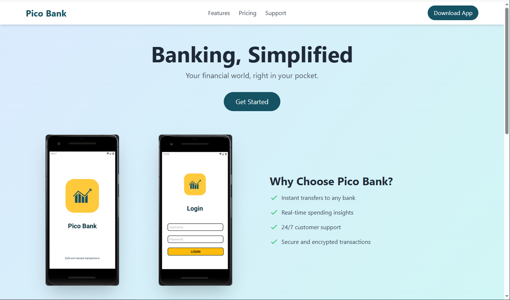

and download the application by clicking on the `Download App`-button in the upper right corner.

### Basic file analysis of the application

Next, we do some basic file analysis of the application. The [APK-format](https://en.wikipedia.org/wiki/Apk_(file_format)) is basically a Zip-bundle of files so we can unpack it with `unzip`.

```bash
┌──(kali㉿kali)-[/mnt/…/picoCTF/picoMini_by_CMU-Africa/Reverse_Engineering/Pico_Bank]
└─$ file pico-bank.apk 
pico-bank.apk: Android package (APK), with gradle app-metadata.properties, with APK Signing Block

┌──(kali㉿kali)-[/mnt/…/picoCTF/picoMini_by_CMU-Africa/Reverse_Engineering/Pico_Bank]
└─$ unzip pico-bank.apk      
Archive:  pico-bank.apk
  inflating: META-INF/com/android/build/gradle/app-metadata.properties  
  inflating: classes3.dex            
  inflating: DebugProbesKt.bin       
 extracting: META-INF/androidx.activity_activity.version  
 extracting: META-INF/androidx.annotation_annotation-experimental.version  
 extracting: META-INF/androidx.appcompat_appcompat-resources.version  
 extracting: META-INF/androidx.appcompat_appcompat.version  
  inflating: META-INF/androidx.arch.core_core-runtime.version  
 extracting: META-INF/androidx.cardview_cardview.version  
 extracting: META-INF/androidx.coordinatorlayout_coordinatorlayout.version  
 extracting: META-INF/androidx.core_core-ktx.version 
 <---snip--->

 ┌──(kali㉿kali)-[/mnt/…/picoCTF/picoMini_by_CMU-Africa/Reverse_Engineering/Pico_Bank]
└─$ find . -type f | xargs strings -n 6 | grep -i picobank
Base_Theme_PicoBank
Lcom/example/picobank/R$color;
!Lcom/example/picobank/R$drawable;
Lcom/example/picobank/R$id;
Lcom/example/picobank/R$layout;
Lcom/example/picobank/R$mipmap;
Lcom/example/picobank/R$string;
Lcom/example/picobank/R$style;
Lcom/example/picobank/R$xml;
Lcom/example/picobank/R;
Theme_PicoBank
Q~~~{"Landroidx/activity/R$id;":"4fcfb741","Landroidx/activity/R;":"d8988df1","Landroidx/annotation/experimental/R;":"11d6a8ac","Landroidx/appcompat/R$anim;":"d8cb519e","Landroidx/appcompat/R$attr;":"65725b2","Landroidx/appcompat/R$bool;":"91861e21","Landroidx/appcompat/R$color;":"71efa297","Landroidx/appcompat/R$dimen;":"5b627732","Landroidx/appcompat/R$drawable;":"8011633d","Landroidx/appcompat/R$id;":"518cb3e5","Landroidx/appcompat/R$integer;":"4e7cfad7","Landroidx/appcompat/R$interpolator;":"b6ae8fa7","Landroidx/appcompat/R$layout;":"7d668e19","Landroidx/appcompat/R$string;":"bf75a7c","Landroidx/appcompat/R$style;":"58f2ea9f","Landroidx/appcompat/R$styleable;":"a3508008","Landroidx/appcompat/R;":"5f612f84","Landroidx/appcompat/resources/R$drawable;":"795e0cb2","Landroidx/appcompat/resources/R$styleable;":"2ab55dae","Landroidx/appcompat/resources/R;":"9aca1132","Landroidx/arch/core/R;":"ea3f7f1f","Landroidx/cardview/R$attr;":"98b51478","Landroidx/cardview/R$color;":"a3e042f9","Landroidx/cardview/R$dimen;":"d4063294","Landroidx/cardview/R$style;":"7f3d37dc","Landroidx/cardview/R$styleable;":"f86bb108","Landroidx/cardview/R;":"3cd9cb86","Landroidx/constraintlayout/widget/R$anim;":"48472ed","Landroidx/constraintlayout/widget/R$attr;":"41271524","Landroidx/constraintlayout/widget/R$bool;":"8d9db849","Landroidx/constraintlayout/widget/R$color;":"74f9741d","Landroidx/constraintlayout/widget/R$dimen;":"c28c650e","Landroidx/constraintlayout/widget/R$drawable;":"48466e27","Landroidx/constraintlayout/widget/R$id;":"d78652db","Landroidx/constraintlayout/widget/R$integer;":"c49d0030","Landroidx/constraintlayout/widget/R$interpolator;":"548ccc30","Landroidx/constraintlayout/widget/R$layout;":"5026016e","Landroidx/constraintlayout/widget/R$string;":"1cd8af8d","Landroidx/constraintlayout/widget/R$style;":"e329dab3","Landroidx/constraintlayout/widget/R$styleable;":"ec9c559c","Landroidx/constraintlayout/widget/R;":"979e33a2","Landroidx/coordinatorlayout/R$attr;":"7825036b","Landroidx/coordinatorlayout/R$color;":"e1fd9adc","Landroidx/coordinatorlayout/R$dimen;":"31fc981","Landroidx/coordinatorlayout/R$drawable;":"d0ee2b41","Landroidx/coordinatorlayout/R$id;":"53c01c0c","Landroidx/coordinatorlayout/R$integer;":"6fcfc787","Landroidx/coordinatorlayout/R$layout;":"b926234c","Landroidx/coordinatorlayout/R$string;":"7d2f3307","Landroidx/coordinatorlayout/R$style;":"410f91d2","Landroidx/coordinatorlayout/R$styleable;":"d1e58e59","Landroidx/coordinatorlayout/R;":"8b72d35","Landroidx/core/R$attr;":"9ff9733f","Landroidx/core/R$color;":"455f4410","Landroidx/core/R$dimen;":"76abe405","Landroidx/core/R$drawable;":"188cbd65","Landroidx/core/R$id;":"380f89f1","Landroidx/core/R$integer;":"d8a70a94","Landroidx/core/R$layout;":"74380075","Landroidx/core/R$string;":"3542e922","Landroidx/core/R$style;":"78f93c56","Landroidx/core/R$styleable;":"81ad3100","Landroidx/core/R;":"55b312d1","Landroidx/core/ktx/R;":"19d99eac","Landroidx/cursoradapter/R;":"f76d6a60","Landroidx/customview/R$attr;":"2f99c038","Landroidx/customview/R$color;":"72dbbbd9","Landroidx/customview/R$dimen;":"e96e80ed","Landroidx/customview/R$drawable;":"5d8a44ae","Landroidx/customview/R$id;":"20269dad","Landroidx/customview/R$integer;":"e2533eeb","Landroidx/customview/R$layout;":"d368bad3","Landroidx/customview/R$string;":"b5703229","Landroidx/customview/R$style;":"6fdf9cd7","Landroidx/customview/R$styleable;":"14a0ebd","Landroidx/customview/R;":"f9466daf","Landroidx/documentfile/R;":"cdeeaa5c","Landroidx/drawerlayout/R$attr;":"2529d179","Landroidx/drawerlayout/R$color;":"291f2dc7","Landroidx/drawerlayout/R$dimen;":"6e2f580e","Landroidx/drawerlayout/R$drawable;":"33f545c9","Landroidx/drawerlayout/R$id;":"4390b993","Landroidx/drawerlayout/R$integer;":"601b3e34","Landroidx/drawerlayout/R$layout;":"1b00884b","Landroidx/drawerlayout/R$string;":"7ea6b234","Landroidx/drawerlayout/R$style;":"5ed84863","Landroidx/drawerlayout/R$styleable;":"57f81ba5","Landroidx/drawerlayout/R;":"ba96a6bb","Landroidx/dynamicanimation/R$attr;":"32c10804","Landroidx/dynamicanimation/R$color;":"34c21505","Landroidx/dynamicanimation/R$dimen;":"2849bf50","Landroidx/dynamicanimation/R$drawable;":"6f88ca29","Landroidx/dynamicanimation/R$id;":"e34f9426","Landroidx/dynamicanimation/R$integer;":"1678c09f","Landroidx/dynamicanimation/R$layout;":"f278ee6e","Landroidx/dynamicanimation/R$string;":"c06c43c6","Landroidx/dynamicanimation/R$style;":"99f12c4e","Landroidx/dynamicanimation/R$styleable;":"2e35e69b","Landroidx/dynamicanimation/R;":"2c925e0c","Landroidx/emoji2/R;":"6280666d","Landroidx/emoji2/viewsintegration/R;":"375fb7f9","Landroidx/fragment/R$anim;":"92223110","Landroidx/fragment/R$animator;":"56ae2540","Landroidx/fragment/R$id;":"1402a862","Landroidx/fragment/R$styleable;":"f9a3e059","Landroidx/fragment/R;":"8acc132a","Landroidx/interpolator/R;":"f7db2cf2","Landroidx/legacy/coreutils/R$attr;":"324624c7","Landroidx/legacy/coreutils/R$color;":"cf3f3976","Landroidx/legacy/coreutils/R$dimen;":"5575ce72","Landroidx/legacy/coreutils/R$drawable;":"2fa3e0b1","Landroidx/legacy/coreutils/R$id;":"77f4d1b2","Landroidx/legacy/coreutils/R$integer;":"6af35928","Landroidx/legacy/coreutils/R$layout;":"f1315aa0","Landroidx/legacy/coreutils/R$string;":"e1a12ddd","Landroidx/legacy/coreutils/R$style;":"577f2626","Landroidx/legacy/coreutils/R$styleable;":"df95b4cb","Landroidx/legacy/coreutils/R;":"46fe9d07","Landroidx/lifecycle/livedata/R;":"690b5d1f","Landroidx/lifecycle/livedata/core/R;":"5ef71976","Landroidx/lifecycle/process/R;":"bab1e66a","Landroidx/lifecycle/runtime/R$id;":"9f903db5","Landroidx/lifecycle/runtime/R;":"f4345d83","Landroidx/lifecycle/viewmodel/R$id;":"297047bb","Landroidx/lifecycle/viewmodel/R;":"6531c1a8","Landroidx/lifecycle/viewmodel/savedstate/R;":"5d6e5c5a","Landroidx/loader/R$attr;":"d0b6b836","Landroidx/loader/R$color;":"aabbc520","Landroidx/loader/R$dimen;":"bc0f006","Landroidx/loader/R$drawable;":"4a849420","Landroidx/loader/R$id;":"14fdcf41","Landroidx/loader/R$integer;":"1dfa14cc","Landroidx/loader/R$layout;":"110ecb54","Landroidx/loader/R$string;":"f0f97e15","Landroidx/loader/R$style;":"c515938c","Landroidx/loader/R$styleable;":"79309d9b","Landroidx/loader/R;":"fbd5ee0","Landroidx/localbroadcastmanager/R;":"6cdcc636","Landroidx/print/R;":"ae43deb2","Landroidx/profileinstaller/R;":"52ad8fc5","Landroidx/recyclerview/R$attr;":"4a2f8fcf","Landroidx/recyclerview/R$color;":"92538eb3","Landroidx/recyclerview/R$dimen;":"59e99cf3","Landroidx/recyclerview/R$drawable;":"61ed6def","Landroidx/recyclerview/R$id;":"15ec9e1c","Landroidx/recyclerview/R$integer;":"57d8769c","Landroidx/recyclerview/R$layout;":"1a749a1f","Landroidx/recyclerview/R$string;":"59abe4ee","Landroidx/recyclerview/R$style;":"4c67cf91","Landroidx/recyclerview/R$styleable;":"3f56555","Landroidx/recyclerview/R;":"88cc84ec","Landroidx/savedstate/R$id;":"9d194140","Landroidx/savedstate/R;":"ddec94d1","Landroidx/startup/R$string;":"1acf35f5","Landroidx/startup/R;":"49a1e47a","Landroidx/tracing/R;":"c3d6ab06","Landroidx/transition/R$id;":"e56f9c8f","Landroidx/transition/R;":"fac63f9","Landroidx/vectordrawable/R$attr;":"6f467c7e","Landroidx/vectordrawable/R$color;":"4cbfcb3b","Landroidx/vectordrawable/R$dimen;":"e00897ab","Landroidx/vectordrawable/R$drawable;":"9dc2f43c","Landroidx/vectordrawable/R$id;":"b71c47f","Landroidx/vectordrawable/R$integer;":"1fd4db2d","Landroidx/vectordrawable/R$layout;":"fe7ee3e","Landroidx/vectordrawable/R$string;":"772de90d","Landroidx/vectordrawable/R$style;":"96cce777","Landroidx/vectordrawable/R$styleable;":"3e51d38b","Landroidx/vectordrawable/R;":"b079a57b","Landroidx/vectordrawable/animated/R$attr;":"c6401d12","Landroidx/vectordrawable/animated/R$color;":"5a58f104","Landroidx/vectordrawable/animated/R$dimen;":"89c23ae7","Landroidx/vectordrawable/animated/R$drawable;":"5b364f0e","Landroidx/vectordrawable/animated/R$id;":"be4a28c","Landroidx/vectordrawable/animated/R$integer;":"84624cef","Landroidx/vectordrawable/animated/R$layout;":"1d642979","Landroidx/vectordrawable/animated/R$string;":"e4afdbf2","Landroidx/vectordrawable/animated/R$style;":"ca70eb6","Landroidx/vectordrawable/animated/R$styleable;":"6bac3cca","Landroidx/vectordrawable/animated/R;":"c394c56","Landroidx/versionedparcelable/R;":"bde5ffe1","Landroidx/viewpager/R$attr;":"cf580c13","Landroidx/viewpager/R$color;":"2d7ca3a0","Landroidx/viewpager/R$dimen;":"83d2824a","Landroidx/viewpager/R$drawable;":"b934bcf5","Landroidx/viewpager/R$id;":"909e63d6","Landroidx/viewpager/R$integer;":"5e22aa6d","Landroidx/viewpager/R$layout;":"f3819043","Landroidx/viewpager/R$string;":"b380fc79","Landroidx/viewpager/R$style;":"f6b07861","Landroidx/viewpager/R$styleable;":"5dbdf949","Landroidx/viewpager/R;":"6e5928af","Landroidx/viewpager2/R$attr;":"d50388b1","Landroidx/viewpager2/R$color;":"84b292e4","Landroidx/viewpager2/R$dimen;":"854def68","Landroidx/viewpager2/R$drawable;":"aa79c03e","Landroidx/viewpager2/R$id;":"2636a725","Landroidx/viewpager2/R$integer;":"96f90994","Landroidx/viewpager2/R$layout;":"87651b6a","Landroidx/viewpager2/R$string;":"c2771f2c","Landroidx/viewpager2/R$style;":"f1774c73","Landroidx/viewpager2/R$styleable;":"d54e8cb8","Landroidx/viewpager2/R;":"8c135f2c","Lcom/android/volley/R;":"8962f753","Lcom/example/picobank/R$color;":"25840afc","Lcom/example/picobank/R$drawable;":"7ca8e386","Lcom/example/picobank/R$id;":"169a7c96","Lcom/example/picobank/R$layout;":"e9c1a8cd","Lcom/example/picobank/R$mipmap;":"896f138e","Lcom/example/picobank/R$string;":"9f565f69","Lcom/example/picobank/R$style;":"c708c577","Lcom/example/picobank/R$xml;":"d2025df1","Lcom/example/picobank/R;":"a31d7239","Lcom/google/android/material/R$anim;":"f94f2852","Lcom/google/android/material/R$animator;":"2d98167a","Lcom/google/android/material/R$attr;":"4cb9f8c7","Lcom/google/android/material/R$bool;":"aecff46b","Lcom/google/android/material/R$color;":"5c985386","Lcom/google/android/material/R$dimen;":"742bc7e3","Lcom/google/android/material/R$drawable;":"d2de46b5","Lcom/google/android/material/R$id;":"9b1b0691","Lcom/google/android/material/R$integer;":"8b1cb01e","Lcom/google/android/material/R$interpolator;":"e4fdb7d7","Lcom/google/android/material/R$layout;":"c485c34c","Lcom/google/android/material/R$plurals;":"e87064d","Lcom/google/android/material/R$string;":"ced3e47b","Lcom/google/android/material/R$style;":"3d57eccf","Lcom/google/android/material/R$styleable;":"d8c3e5e1","Lcom/google/android/material/R;":"21520bad"}
6Lcom/example/picobank/Login$$ExternalSyntheticLambda0;
Lcom/example/picobank/Login$1;
Lcom/example/picobank/Login;
=Lcom/example/picobank/MainActivity$$ExternalSyntheticLambda0;
%Lcom/example/picobank/MainActivity$1;
#Lcom/example/picobank/MainActivity;
=Lcom/example/picobank/Notification$$ExternalSyntheticLambda0;
%Lcom/example/picobank/Notification$1;
#Lcom/example/picobank/Notification;
4Lcom/example/picobank/OTP$$ExternalSyntheticLambda0;
Lcom/example/picobank/OTP$1;
Lcom/example/picobank/OTP$2;
Lcom/example/picobank/OTP$3;
Lcom/example/picobank/OTP;
!Lcom/example/picobank/R$drawable;
Lcom/example/picobank/R$id;
Lcom/example/picobank/R$layout;
Lcom/example/picobank/R$string;
7Lcom/example/picobank/Splash$$ExternalSyntheticLambda0;
Lcom/example/picobank/Splash$1;
Lcom/example/picobank/Splash;
"Lcom/example/picobank/Transaction;
?Lcom/example/picobank/TransactionAdapter$TransactionViewHolder;
)Lcom/example/picobank/TransactionAdapter;
4Ljava/util/List<Lcom/example/picobank/Transaction;>;
~~~{"Lcom/example/picobank/Login$$ExternalSyntheticLambda0;":"4fe6b7fb6","Lcom/example/picobank/Login$1;":"c688de0","Lcom/example/picobank/Login;":"9555ebe","Lcom/example/picobank/MainActivity$$ExternalSyntheticLambda0;":"2031537c8","Lcom/example/picobank/MainActivity$1;":"a0915c67","Lcom/example/picobank/MainActivity;":"36e47405","Lcom/example/picobank/Notification$$ExternalSyntheticLambda0;":"5f2a90ec7","Lcom/example/picobank/Notification$1;":"d5fec989","Lcom/example/picobank/Notification;":"606e4fe6","Lcom/example/picobank/OTP$$ExternalSyntheticLambda0;":"536dab716","Lcom/example/picobank/OTP$1;":"55a592ff","Lcom/example/picobank/OTP$2;":"56e7e78a","Lcom/example/picobank/OTP$3;":"91d2fcfd","Lcom/example/picobank/OTP;":"b4547560","Lcom/example/picobank/Splash$$ExternalSyntheticLambda0;":"4262ca601","Lcom/example/picobank/Splash$1;":"3ee78973","Lcom/example/picobank/Splash;":"9feabfc8","Lcom/example/picobank/Transaction;":"a2b0437c","Lcom/example/picobank/TransactionAdapter$TransactionViewHolder;":"ab54dd86","Lcom/example/picobank/TransactionAdapter;":"e0aba832"}
Base.Theme.PicoBank
Theme.PicoBank
Base.Theme.PicoBank
Theme.PicoBank
```

Some Pico Bank-related strings that might come in handy later!?

### Decompile the application

Then we decompile the application with [Jadx-GUI](https://github.com/skylot/jadx).

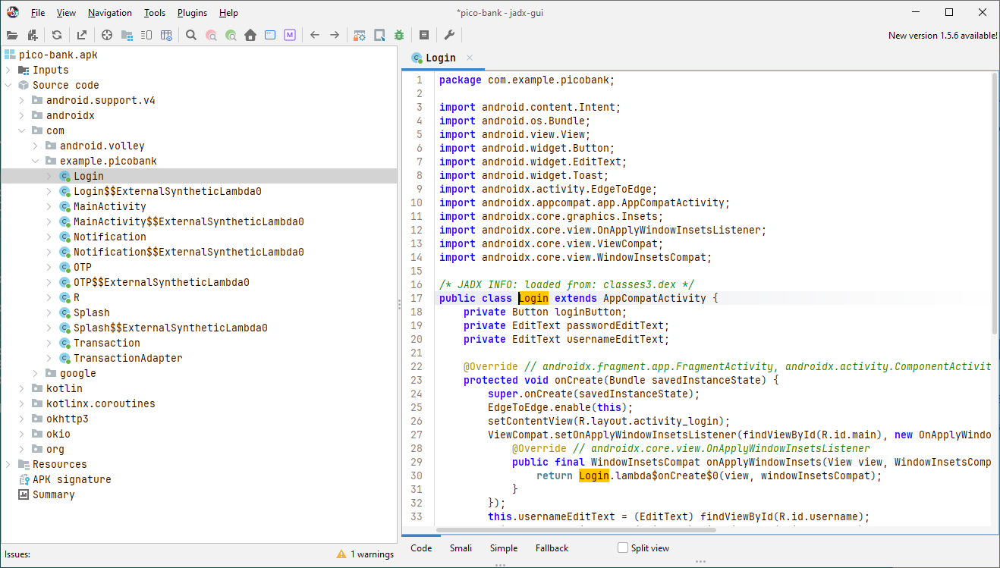

Going through the source code we find:

Credentials (`johnson:tricky1990`) in **Source code -> com -> example.picobank -> Login -> Login()**.

```java
<---snip--->
        this.usernameEditText = (EditText) findViewById(R.id.username);
        this.passwordEditText = (EditText) findViewById(R.id.password);
        this.loginButton = (Button) findViewById(R.id.loginBtn);
        this.loginButton.setOnClickListener(new View.OnClickListener() { // from class: com.example.picobank.Login.1
            @Override // android.view.View.OnClickListener
            public void onClick(View v) {
                String username = Login.this.usernameEditText.getText().toString();
                String password = Login.this.passwordEditText.getText().toString();
                if ("johnson".equals(username) && "tricky1990".equals(password)) {
                    Intent intent = new Intent(Login.this, (Class<?>) OTP.class);
                    Login.this.startActivity(intent);
                    Login.this.finish();
                    return;
                }
                Toast.makeText(Login.this, "Incorrect credentials", 0).show();
            }
        });
<---snip--->
```

Flag related code in **Source code -> com -> example.picobank -> OTP -> OTP()**.

```java
<---snip--->
    public void verifyOtp(String otp) {
        String endpoint = "your server url/verify-otp";
        if (getResources().getString(R.string.otp_value).equals(otp)) {
            Intent intent = new Intent(this, (Class<?>) MainActivity.class);
            startActivity(intent);
            finish();
        } else {
            Toast.makeText(this, "Invalid OTP", 0).show();
        }
        JSONObject postData = new JSONObject();
        try {
            postData.put("otp", otp);
        } catch (JSONException e) {
            e.printStackTrace();
        }
        JsonObjectRequest jsonObjectRequest = new JsonObjectRequest(1, endpoint, postData, new Response.Listener<JSONObject>() { // from class: com.example.picobank.OTP.2
            @Override // com.android.volley.Response.Listener
            public void onResponse(JSONObject response) {
                try {
                    boolean success = response.getBoolean("success");
                    if (success) {
                        String flag = response.getString("flag");
                        String hint = response.getString("hint");
                        Intent intent2 = new Intent(OTP.this, (Class<?>) MainActivity.class);
                        intent2.putExtra("flag", flag);
                        intent2.putExtra("hint", hint);
                        OTP.this.startActivity(intent2);
                        OTP.this.finish();
                    } else {
                        Toast.makeText(OTP.this, "Invalid OTP", 0).show();
                    }
                } catch (JSONException e2) {
                    e2.printStackTrace();
                }
<---snip--->
```

And the OTP value in **Resources -> resources.arsc -> res -> values -> strings.xml**.

```java
<---snip--->
    <string name="mtrl_timepicker_confirm">OK</string>
    <string name="otp_value">9673</string>
    <string name="password_toggle_content_description">Show password</string>
<---snip--->
```

### Setup Android Studio

Next, we open the APK-file in [Android Studio](https://developer.android.com/studio).  
Choose `Profile or Debug APK` in the menu to the right in the Welcome view and select the APK-file.

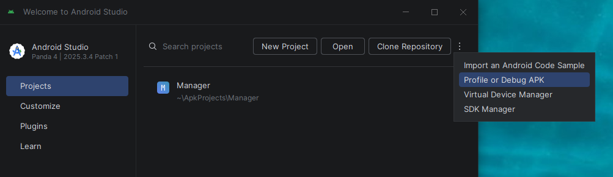

From the `AndroidManifest.xml` file we can see that the application uses API Level `34`.

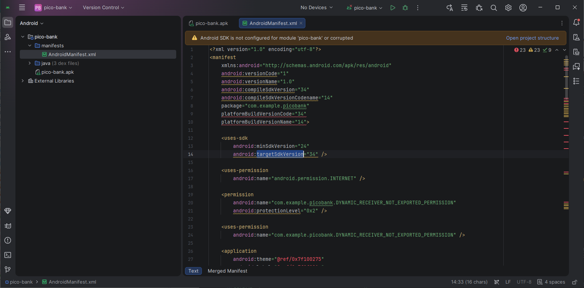

If the Android SDK isn't installed already we need to install it. This is done as follows:

- In the `File`-menu select `Settings...`
- Under `Languages & Frameworks`, select `Android SDK`
- Install Android 14.0 (API Level 34).

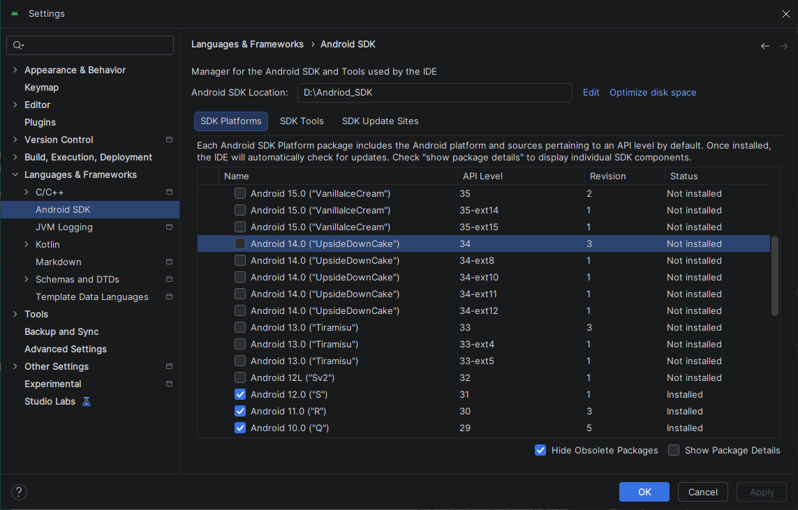

Wait for any needed files to be downloaded and unpacked.

We also need to create a Virtual Device. In the `Tools`-menu, select `Device Manager`.  
It should open in the right-most pane. Click `Add a new device...`.

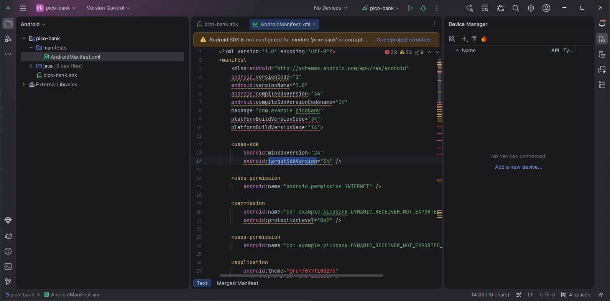

Click `Create Virtual Device` and select `Pixel 4` in the menu.  
Press `Next`, set the API to `API 34 "UpsideDownCake"; Android 14.0` and select the Google Play image.

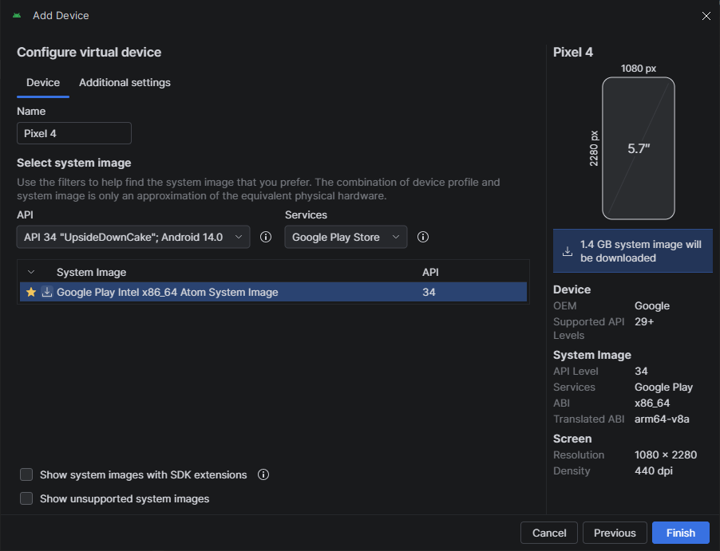

And finally click `Finish`.

### Run the app in Android Studio

Now we can run the application. Make sure the `Pixel 4` device is selected and press the `Play` button.

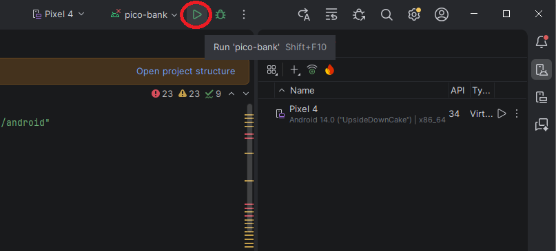

When the application has started, Android Studio looks like this:

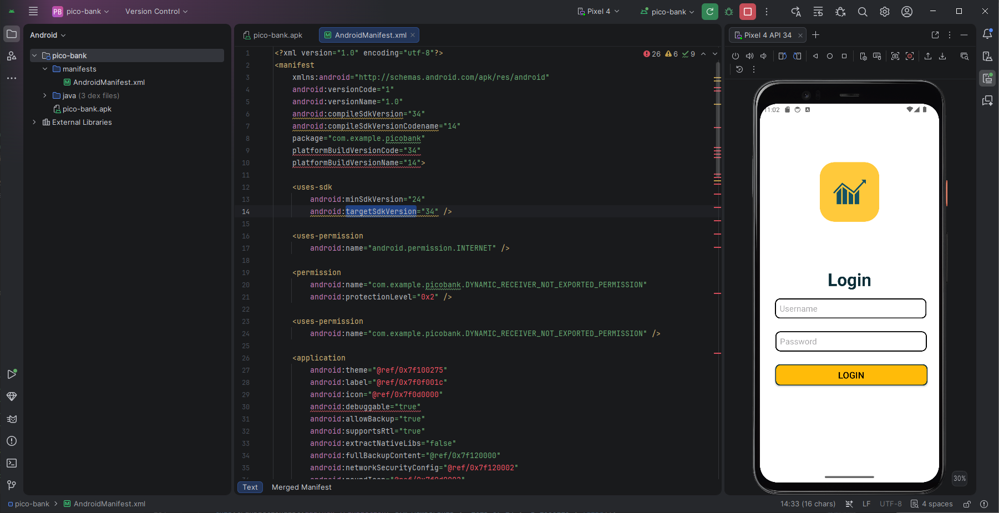

### Login to Pico Bank

Now we login to Pico Bank with `johnson:tricky1990` and the OTP-code `9673`.

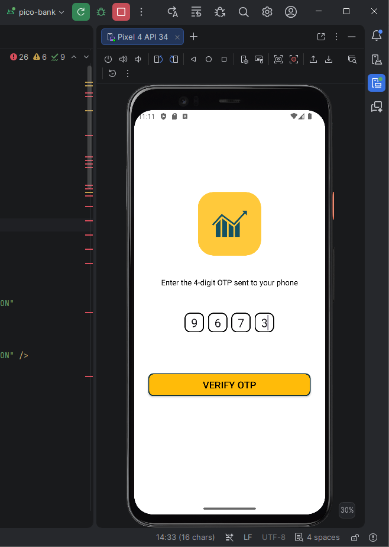

We can see our balance and get a list of transactions:

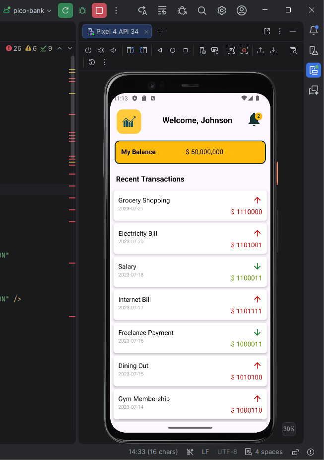

### Get the Flag - Hints

Under notifications in the Pico Bank application we find two hints where we should look for the flag parts.

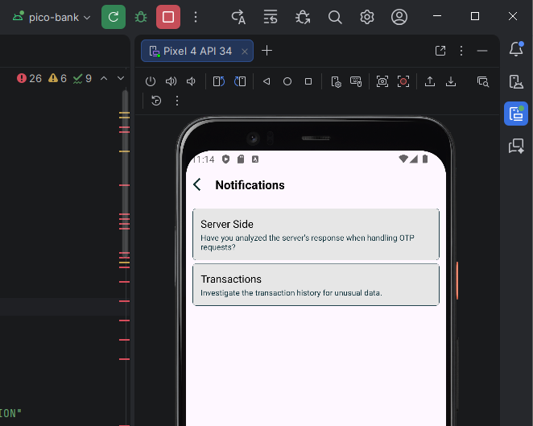

### Get the flag - Part 1

Looking for the transactions, we find the related code in Jadx-GUI under **Source code -> com -> example.picobank -> MainActivity -> transactionList**

```java
<---snip--->
        this.transactionList = new ArrayList();
        this.transactionList.add(new Transaction("Grocery Shopping", "2023-07-21", "$ 1110000", false));
        this.transactionList.add(new Transaction("Electricity Bill", "2023-07-20", "$ 1101001", false));
        this.transactionList.add(new Transaction("Salary", "2023-07-18", "$ 1100011", true));
        this.transactionList.add(new Transaction("Internet Bill", "2023-07-17", "$ 1101111", false));
        this.transactionList.add(new Transaction("Freelance Payment", "2023-07-16", "$ 1000011", true));
        this.transactionList.add(new Transaction("Dining Out", "2023-07-15", "$ 1010100", false));
        this.transactionList.add(new Transaction("Gym Membership", "2023-07-14", "$ 1000110", false));
        this.transactionList.add(new Transaction("Stocks Dividend", "2023-07-13", "$ 1111011", true));
        this.transactionList.add(new Transaction("Car Maintenance", "2023-07-12", "$ 110001", false));
        this.transactionList.add(new Transaction("Gift Received", "2023-07-11", "$ 1011111", true));
        this.transactionList.add(new Transaction("Rent", "2023-07-10", "$ 1101100", false));
        this.transactionList.add(new Transaction("Water Bill", "2023-07-09", "$ 110001", false));
        this.transactionList.add(new Transaction("Interest Earned", "2023-07-08", "$ 110011", true));
        this.transactionList.add(new Transaction("Medical Expenses", "2023-07-07", "$ 1100100", false));
        this.transactionList.add(new Transaction("Transport", "2023-07-06", "$ 1011111", false));
        this.transactionList.add(new Transaction("Bonus", "2023-07-05", "$ 110100", true));
        this.transactionList.add(new Transaction("Subscription Service", "2023-07-04", "$ 1100010", false));
        this.transactionList.add(new Transaction("Freelance Payment", "2023-07-03", "$ 110000", true));
        this.transactionList.add(new Transaction("Entertainment", "2023-07-02", "$ 1110101", false));
        this.transactionList.add(new Transaction("Groceries", "2023-07-01", "$ 1110100", false));
        this.transactionList.add(new Transaction("Insurance Premium", "2023-06-28", "$ 1011111", false));
        this.transactionList.add(new Transaction("Charity Donation", "2023-06-26", "$ 1100010", true));
        this.transactionList.add(new Transaction("Vacation Expense", "2023-06-26", "$ 110011", false));
        this.transactionList.add(new Transaction("Home Repairs", "2023-06-24", "$ 110001", false));
        this.transactionList.add(new Transaction("Pet Care", "2023-06-22", "$ 1101110", false));
        this.transactionList.add(new Transaction("Personal Loan", "2023-06-18", "$ 1100111", true));
        this.transactionList.add(new Transaction("Childcare", "2023-06-15", "$ 1011111", false));
        this.transactionAdapter = new TransactionAdapter(this.transactionList);
        this.transactionsRecyclerView.setAdapter(this.transactionAdapter);
    }
    <---snip--->
```

We note that all transactions have binary values. Let's convert them to ASCII with a small Python script.

```python
#!/usr/bin/env python

transactions = [
    "1110000",  "1101001", "1100011", "1101111", "1000011",  
    "1010100", "1000110", "1111011", "110001",   "1011111", 
    "1101100", "110001", "110011",   "1100100", "1011111", 
    "110100", "1100010",  "110000",  "1110101", "1110100",
    "1011111",  "1100010", "110011",  "110001", "1101110",  
    "1100111", "1011111"
]

bin_func = lambda x: chr(int(x, 2))
flag = map(bin_func, transactions)
print("".join(flag))
```

Running the script gives us the first part of the flag

```bash
┌──(kali㉿kali)-[/mnt/…/picoCTF/picoMini_by_CMU-Africa/Reverse_Engineering/Pico_Bank]
└─$ ./transactions.py
picoCTF{1_l13d_<REDACTED>
```

### Get the flag - Part 2

We get the other part flag by POSTing to the `/verify-otp` endpoint and check the response.

```bash
┌──(kali㉿kali)-[/mnt/…/picoCTF/picoMini_by_CMU-Africa/Reverse_Engineering/Pico_Bank]
└─$ curl -s -X POST http://amiable-citadel.picoctf.net:62690/verify-otp --json '{"otp":"9673"}' | jq
{
  "success": true,
  "message": "OTP verified successfully",
  "flag": "s3cur3d_<REDACTED>}",
  "hint": "The other part of the flag is hidden in the app"
}
```

For additional information, please see the references below.

## References

- [Android Studio - Homepage](https://developer.android.com/studio)
- [apk (file format) - Wikipedia](https://en.wikipedia.org/wiki/Apk_(file_format))
- [ASCII - Wikipedia](https://en.wikipedia.org/wiki/ASCII)
- [Burp suite - Documentation](https://portswigger.net/burp/documentation)
- [Burp suite - Homepage](https://portswigger.net/burp)
- [curl - Homepage](https://curl.se/)
- [curl - Linux manual page](https://man7.org/linux/man-pages/man1/curl.1.html)
- [cURL - Wikipedia](https://en.wikipedia.org/wiki/CURL)
- [file - Linux manual page](https://man7.org/linux/man-pages/man1/file.1.html)
- [find - Linux manual page](https://man7.org/linux/man-pages/man1/find.1.html)
- [Genymotion - Download - Homepage](https://www.genymotion.com/product-desktop/download/)
- [grep - Linux manual page](https://man7.org/linux/man-pages/man1/grep.1.html)
- [Jadx-GUI - GitHub](https://github.com/skylot/jadx)
- [join - string method - Python Docs](https://docs.python.org/3/library/stdtypes.html#str.join)
- [jq - GitHub](https://github.com/jqlang/jq)
- [jq - Homepage](https://jqlang.org/)
- [jq - Linux manual page](https://manpages.ubuntu.com/manpages/xenial/man1/jq.1.html)
- [JSON - Wikipedia](https://en.wikipedia.org/wiki/JSON)
- [lambda expression - Python Docs](https://docs.python.org/3/howto/functional.html#small-functions-and-the-lambda-expression)
- [map function - Python Docs](https://docs.python.org/3/library/functions.html#map)
- [Python (programming language) - Wikipedia](https://en.wikipedia.org/wiki/Python_(programming_language))
- [strings - Linux manual page](https://man7.org/linux/man-pages/man1/strings.1.html)
- [unzip - Linux manual page](https://linux.die.net/man/1/unzip)
- [xargs - Linux manual page](https://www.man7.org/linux/man-pages/man1/xargs.1.html)
